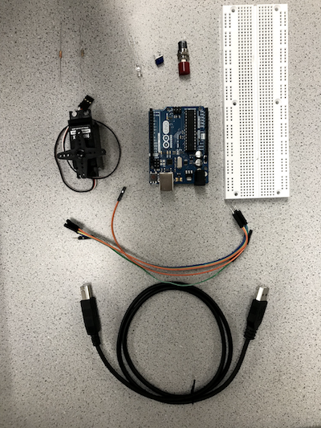
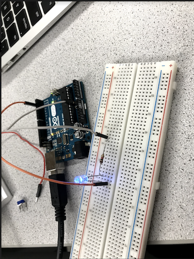
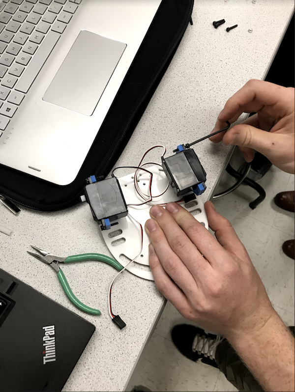
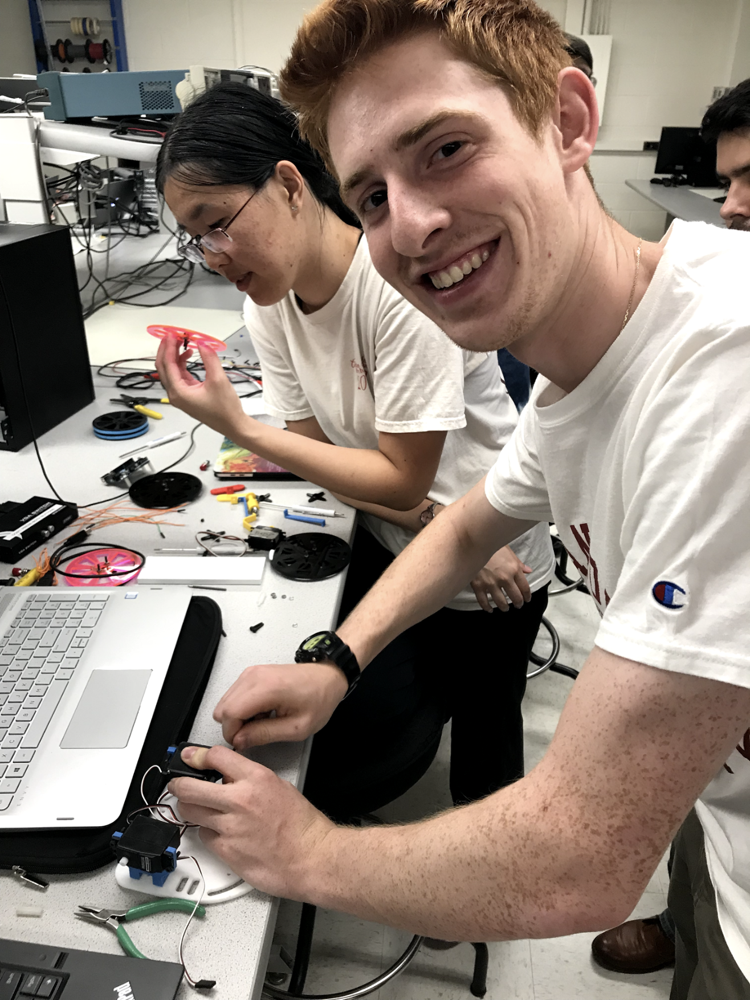

## LAB 1: Introduction to Micro-controllers

---

### Objective
In this introductory lab, we learned how to use the various functionalities of the Arduino Uno and the Arduino IDE. Our team constructed a simple functional Arduino program using multiple external components and the Arduino Uno. Once we mastered this basic understanding, we put together our robot and had it perform a simple autonomous task like turning in nearly 90-degree angles and as an
extra feature, following a black-taped line using an IR Sensor.

### Materials
  * Arduino IDE Software
  * 1 Arduino Uno
  * 1 USB A/B cable
  * 1 Continuous rotation servo
  * 1 LED (we chose a blue LED)
  * 1 Potentiometer
  * Several resistors (300Ω and kΩ range)
  * 1 Solderless breadboard



### Blinking an internal LED
The “Blink” example code was used to test the communication between the Arduino Uno and the IDE. At first, the code was compiled and uploaded without any modifications, and the on-board LED blinked on and off according to a certain value of delay.

```c
// the setup function runs once when you press reset or power the board
void setup() {
  // initialize digital pin LED_BUILTIN as an output.
  pinMode(LED_BUILTIN, OUTPUT);
}

// the loop function runs over and over again forever
void loop() {
  digitalWrite(LED_BUILTIN, HIGH);   // turn the LED on (HIGH is the voltage level)
  delay(1000);                       // wait for a second
  digitalWrite(LED_BUILTIN, LOW);    // turn the LED off by making the voltage LOW
  delay(1000);                       // wait for a second
}
```

### Blinking an external LED
To test the digital pins, an external blue LED was connected to digital **pin 13** in series with a 1k Ohm resistor. The external LED blinked on and off according to a certain value of delay.



### Reading the value of a potentiometer
To test the analog input pins, a **potentiometer** was connected to analog input **pin 0** in series with a 1k Ohm resistor to input different voltages. For data analysis, we used enabled the serial monitor to display the analog value every half second.


### Map the value of the potentiometer to the LED
Then the potentiometer was combined with the external LED circuit. The digital pin which the LED was connected to was set up as an PWM output pin. A square wave was generated to write analog voltages to the LED. This allowed the brightness of the LED to be adjusted with the potentiometer.

 <div style="text-align: center">
 <iframe width="534" height="300" src="https://www.youtube.com/embed/kLw2cUVWrg4" frameborder="0" allowfullscreen></iframe>
 </div>
 
In the following image, the oscilloscope described a *Pulse Width Modulator (PWM)*, which is a very fast square wave with differing on and off times. Our team's pulse (time between ON and OFF) was about 18.5 ns:


### Map the value of the potentiometer to the servo
During this stage, the white input signal wire on the parallax servo was connected to pin 9 so that it can read analog output generated by the potentiometer. The red wire was connected to 5V, and black wire was connected to GND. Example code Servo Knob was used in this part. The potentiometer values are scaled between 0 to 180 corresponding to servo speed. Value 0 and 180 represent full speed in opposite directions and 90 represents stop.

 <div style="text-align: center">
 <iframe width="534" height="300" src="https://www.youtube.com/embed/PpK9aHq-Jpg" frameborder="0" allowfullscreen></iframe>
 </div>

### Assemble your robot

During the assembly of the robot, we attached a wheel to each of the servo to allow mobility. Then the wheels were attached to the two sides of the chasis using screws. The Arduino circuit and the battery were put on top of the chasis. A ball bearing was attached to the front of the chasis for support.

#### Here is a picture of the initial steps of assembling the robot:


We decided to go with bigger wheels in order to analyze how the robot behaves with such large tiles and the amount of speed it can reach.

#### Here is a picture of team members Eric Berg and Christine Ou starting the assembly of the wheels:


### Driving your robot autonomously
As an extra feature for Lab 1, our team included an IR sensor that detected the existence of a black tape and knew the difference in color with respect to the white tiles on the floor. Using different sensors to manipulate the data acquired and programming our robot to react in a certain depending on the environment stimulation, is what actually makes it autonomous. On future labs, the team is planning on including different sensors like ultrasonic sensor for detecting the walls inside the maze, and maybe even position sensors to map the trajectory of the robot while solving the maze.

 <div style="text-align: center">
 <iframe width="534" height="300" src="https://www.youtube.com/embed/2YqA4jH7Dto" frameborder="0" allowfullscreen></iframe>
 </div>
 
After seeing how the robot was behaving when approaching a tight curve like the one in the video, we realized that we were putting too much speed for the servo motors to achieve smooth left and right turns. Therefore, we lowered both servos' speeds and found a more efficient combination that definitely improved the robot's behavior.

#### Program used to follow the edge of the line using an IR sensor

```c
/*
 *  LineFollow.ino
 *  
 *  Uses a very basic algorithm to have the robot follow
 *  a black line on a white background
 */
#include <Servo.h>
// Declare two Servo objects - one to control each servo
Servo rightServo;
Servo leftServo;
// Stores the pin # that is connected to the IR sensor
const int analogInPin = 0;
// Will use this to store the value from the ADC
int sensorValue;
void setup() {
  // Connect right servo to pin 9, left servo to pin 10
  rightServo.attach(9);
  leftServo.attach(10);
}
void loop() {
  // Read the value from the ADC connected to the IR sensor
  sensorValue = analogRead(analogInPin);
  // We decided on using 700 to partition the range of values after some experimentation
  if(sensorValue > 700) {
      // Turn left

      // 180 = full power clockwise
      // 89  = low power counter-clockwise
      rightServo.write(180);
      leftServo.write(89);
  }else{
      // Turn right

      // 91 = low power clockwise
      // 0  = full power counter-clockwise
      rightServo.write(91);
      leftServo.write(0);
  }
  delay(25);
}
```
 <div style="text-align: center">
 <iframe width="534" height="300" src="https://www.youtube.com/embed/kUykOyhvOOE" frameborder="0" allowfullscreen></iframe>
 </div>
 
### Conclusions

The feedback we received from the robot's behavior has enabled our team to start thinking about how to build all the mechanical components, as well as how to write the motion algorithms based on sensor data analysis. We arrived to the conclusion that the servos can definitely behave strangely if not properly connected to power, contributing to an erroneous behavior from the robot. Also, with the inclusion of **relatively large** wheels, we confirmed that there is a serious tradeoff between speed and robustness. Even though we were one of the fastest teams in our lab session, we had to struggle and improvise a *sketchy* way of placing the sensor because of the ridiculous height of the robot.
