## LAB 2: Analog Circuitry and FFTs

### Objective

In this lab, we added different sensors to our robot, and made analog circuits
and a digital filter to interface with the Arduino. One is a microphone circuit
that detects a 660Hz whistle blow signifying the beginning of your maze mapping.
The other captures inputs from an IR sensor to detect an IR treasure blinking
at 7kHz.

## Acoustic Team

<div style="text-align:center"> 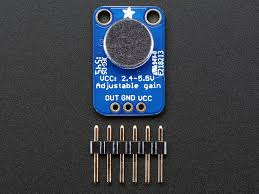 </div>

### Materials

  * Arduino Uno
  * Electret Microphone Amplifier - MAX4466 with Adjustable Gain
  * ~3 kΩ resistor
  * Function Generator
  * Oscilloscope
  * Tone generator phone-application

### Analysis of the microphone in the built-in system

When we started assembling our circuit, we made sure to test its different
components in order to make debugging easier in the future. The Electret Microphone was working perfectly according to the oscilloscope, since we could appreciate the difference in certain tones and noises. We obtained the following feedback after setting up an effective low-pass filter with a cut off frequency of 796 Hz using a 1µF capacitor and a ~200Ω resistor:

<div style="text-align:center">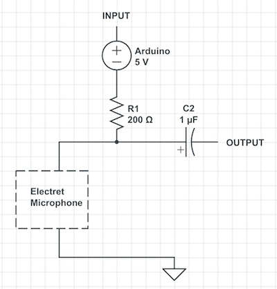</div>

Please, watch a quick demonstration of the functionality of our circuit so far:

<div style="text-align: center">
<iframe width="534" height="300" src="https://www.youtube.com/embed/f3Jj78DgqsM" frameborder="0" allowfullscreen></iframe>
</div>

For the purpose of the competition, we needed to amplify the signal since there is going to be a lot of background noise in Phillips Hall. We assembled a non-inverting amplifier with 10kΩ and 100kΩ, therefore having a gain of 10. However, we were not getting a signal at all, and the faculty even checked and validated our circuit before reaching any false conclusions. It was in fact a defectuous op amp, and many of the other teams were having the same issue. That is why we switched to a fully functional Electret Microphone Amplifier - MAX4466. This device already contained the desired analog filters, and an adjustable gain ranging from 4 to 26 -measured by our team using the function generator and the oscilloscope-:

* Peak-Peak Voltage at 660 Hz with microphone only: 200.0 mV
* Peak-Peak Voltage at 660 Hz with the built-in amplifier (MIN): 800 mV Amplifier gain: 4
* Peak-Peak Voltage at 660 Hz with the built-in amplifier (MAX): 5.28 V Amplifier gain: 26.4

From this lab, until the competition, we will work with such device to solve the acoustic challenges.

### Testing the Fast Fourier Transform algorithm provided by the Arduino

First of all, let's discuss why the Fast Fourier Transform Algorithm is the right way to solve our issue. A fast Fourier transform (FFT) algorithm computes the discrete Fourier transform (DFT) of a sequence, or its inverse (IFFT). Fourier analysis converts a signal from its original domain (often time or space) to a representation in the frequency domain and vice versa. An FFT rapidly computes such transformations by factorizing the DFT matrix into a product of sparse (mostly zero) factors. As a result, it manages to reduce the complexity of computing the DFT from `O(n^2)`, which arises if one simply applies the definition of DFT, to `O(nlogn)`, where n is the data size.

Now let's get into the process of using this powerful tool. We started testing the function generator by hooking it up directly to the oscilloscope and make sure it was working properly. We tested it with a 660Hz frequency, 2.55Vpp amplitude, and 1.25V offset. Here is the feedback of the experiment:

Function Generator         |  Oscilloscope
:-------------------------:|:-------------------------:
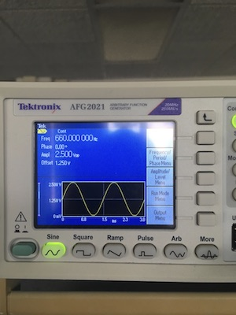  |  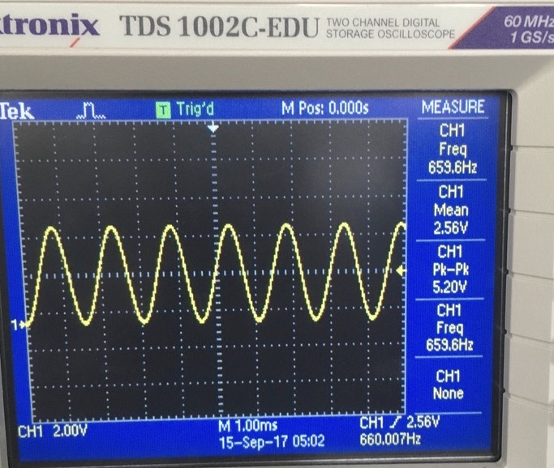  

With the function generator working properly, it was time to test the FFT algorithm provided by the Arduino Library `<FFT.h>`. Before assembling the circuit together, we had to do some work to figure out where our 660Hz frequency would fall inside the output from the FFT.

The ADC clock is set by the main clock speed of the Arduino, divided by a specific pre-scalar. The Arduino's clock frequency is 16MHz, and the pre-scalar set by the ADC inside the code `ADCSRA = 0xe5; // set the ADC to free running mode` is 32. If we divide 16MHz / 32, we obtain a clock frequency of 500KHz for the ADC. For it to convert an analog signal into a very precise digital signal of 10 bits, it takes 13 entire cycles. This would be 500KHz / 13 which yields a frequency of 38.4KHz. However, the ADC divides its reading into 256 separate points, which symbolize the range of values in each frequency bin. If we divide 38.4KHz / 256, we obtain 150Hz as our bin range. Therefore, each frequency bin contain values ranging from x to x + 150Hz. Our desired frequency to detect is 660Hz, which according to a simple division of 660Hz / 150Hz should appear in either bin 4 or bin 5. With the theoretical reasoning behind it, we tested the ADC using the function generator at different frequencies, all of them integer multiples of 660Hz in order to analyze precision and to check if there was an even space between the bins. This was our result:

<div style="text-align:center"></div>

And this is the data that we obtained from the graph regarding different bins and frequencies `(Frequency:Bin)` :

(660: 5), (1320: 10), (1980: 14), (2640: 19), (3300: 23), (3960: 27), (4620: 32), (5280: 36)

Our feedback was what we expected! We not only read the 660Hz in bin 5, but we could actually see the even spacing between the bins of the frequencies multiples of 660Hz -as it was expected as well, of course-. With that out of the way, we proceeded to actually test the circuit with our own 660Hz tone.

### Testing the circuit with a 660 Hz tone

Before doing any further analysis of the signal, or even editing the code to display any data, our team did a small double-check test to see how the circuit reacted to (1) people talking in the background, (2) a random song, and (3) the 660Hz tone generated from the mobile application we downloaded. This graph clearly portrays the result:

<div style="text-align:center">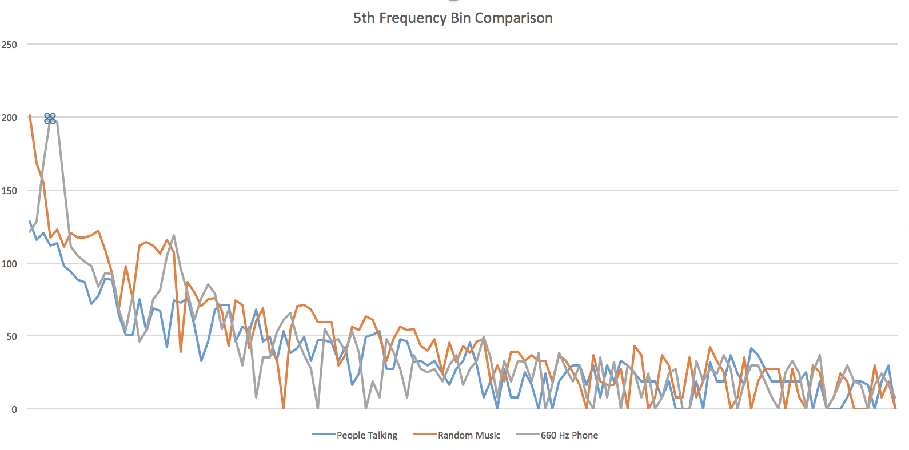</div>

At the dotted spot, we can see how the 5th frequency bin is at its peak in the 660Hz tone graph, while the other two are really low at that point. This tells us three things:
1. Our circuit is definitely recognizing the 660Hz above all.
2. The signal can get tampered by outside noise, so we cannot rely on the reading at ONE specific point in time. We need a *moving average algorithm*!
3. We need to work on filtering the signal even more so that we can set it apart from other relatively close signals -such as 585Hz (bin 4) or 735Hz (bin 6)-.

#### Moving average

A moving average is a succession of averages derived from successive segments (typically of constant size and overlapping) of a series of values. Here is how we accomplished ours:

```c
// Moving average variables
const int numReadings = 10;

int readings[numReadings];      // the readings from the analog input
int readIndex = 0;              // the index of the current reading
int total = 0;                  // the running total
int average = 0;                // the average


// Moving average algorithm --------------------------------------

// subtract the last reading:
total = total - readings[readIndex];

// read from the sensor:
readings[readIndex] = fft_log_out[4]; // fft_log_out[4] represents the 5th bin being outputted by the ADC

// add the reading to the total:
total = total + readings[readIndex];

// advance to the next position in the array:
readIndex = readIndex + 1;

// if we're at the end of the array...
if (readIndex >= numReadings) {
  // ...wrap around to the beginning:
  readIndex = 0;
}

// calculate the average:
average = (int)(total / numReadings);
```

We definitely saw an improvement regarding the stability of the signal readings, since it was not fluctuating so much as before. Now it was time to focus on the 3rd point that was mentioned above.

### Distinguish a 660Hz tone (from tones at 585Hz and 735Hz)

When testing our circuit to see if it could recognize the different frequencies (585Hz, 660Hz, 735Hz), we stumbled across an interesting issue. The circuit was activated with the three frequencies instead of just 660Hz! And we could see why: 585Hz, 660Hz, and 735Hz fall within -or really close- the same 5th frequency bin. Refer to the following picture for the data recollected:

<div style="text-align:center">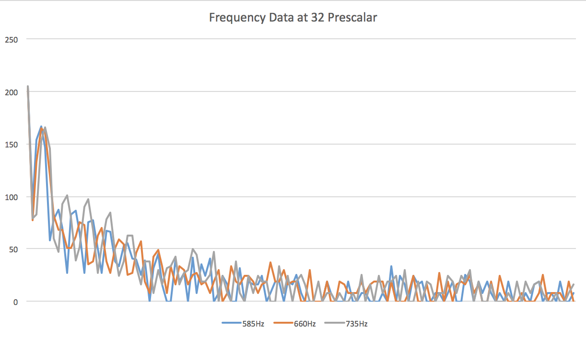</div>

The three frequencies definitely fall really close to each other, so it expected that the circuit does not recognize each of them individually. We came up with a solution that was very effective and it involved the slowing of the ADC clock. In the previous sections, we had pre-scalar of 32 and that was giving us a bins with a frequency range of approximately 150Hz. We cannot afford to keep working like this, since this 150Hz range contains -or is really close to- the three frequencies above. Our solution was to alter the pre-scalar by changing the following line in the Arduino: `ADCSRA = 0xe5;` to `ADCSRA = 0xe7;`. This sets the value of the pre-scalar to 128, which yields the following result: 16MHz / 256 points / 13 cycles / 128 ps = 37.56Hz frequency range for each bin. This result is great! With a smaller range, our three frequencies will fall more apart from each other and therefore will be recognized independently by the Arduino. Refer to the following graph for the new circuit performance:

<div style="text-align:center">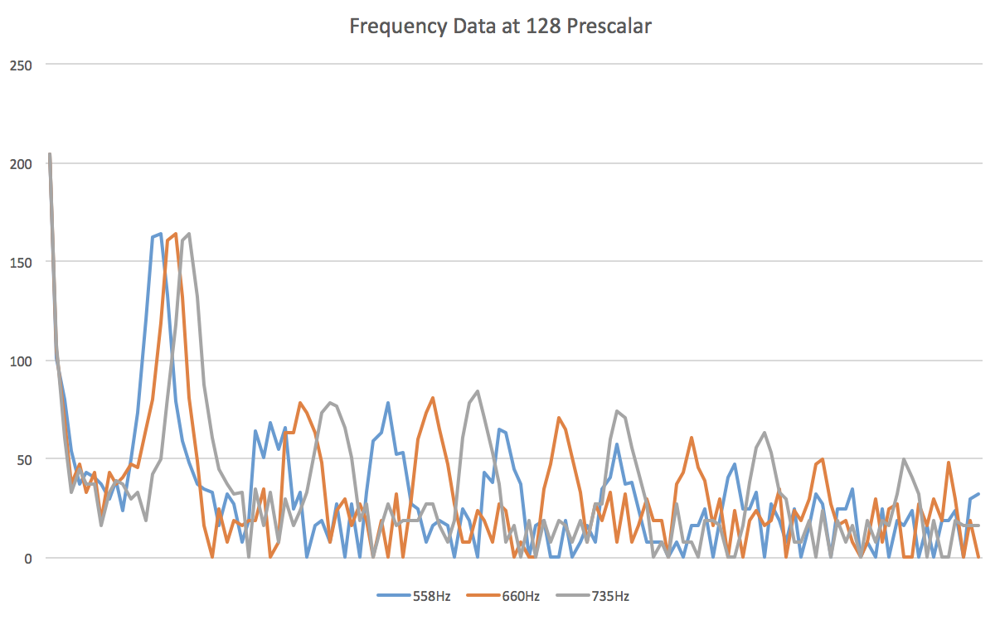</div>

In this case, 585Hz falls in bin 16, 660Hz falls in bin 18, and 785Hz falls in bin 20. To separate them even more, we came up with a simple, yet effective idea to make our signal stronger: a digital filter. Although it may sound hard, it is just a mathematical algorithm to set apart values that are different already. This is the code that we used:

```
// Digital Filter Algorithm
average = (average - 50) * 100;
```

This expression actually created a bigger difference that expected regarding the separation of the signal. We were able to detect the 660Hz -nothing lower or higher- at a considerable distance of 10 inches! Considering that in the actual competition, the starting tone speaker will be approximately 5 inches apart and at a full volume, we can safely consider our circuit to work very effective. Please, take a look at the comparison between the three frequencies' outputs at random bins, running the function generator at 660Hz:

<div style="text-align:center">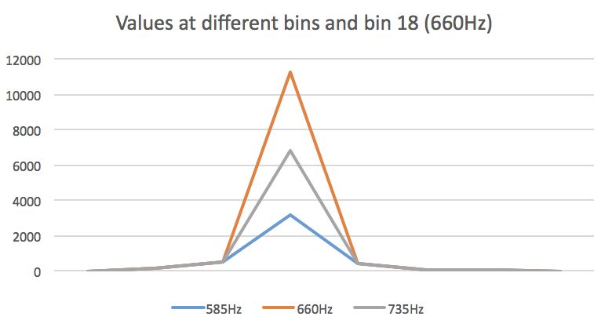</div>

To test it even further, we created the following function to help us visualize the reaction of the Arduino in the presence of the tone:

```c
void detectingTone(int value){
  if(value > 8000){
      Serial.println("Yes");
    }
    else{
      Serial.println("No");
    }
}
```

The variable `value` is the output of the moving average, which is compared to 8000 -a generic value determined by testing the circuit with other signals- to output either "Yes" or "No". Please, see a demonstration of the process in the following video:

<div style="text-align: center">
<iframe width="534" height="300" src="https://www.youtube.com/embed/1Al7tk_LpDg" frameborder="0" allowfullscreen></iframe>
</div>

### Conclusions

Our team has done a great job figuring out the endless possibilities to solve the issues that come along this project. We used different techniques and principles of signal analysis to not only convert analog to digital signal, but to filter them in both states. We practiced how to filter our signal using high and low pass filters, as well as digital filters. We worked with operational amplifiers to amplify our analog input, and very importantly, we had the opportunity to analyze the data obtained from the ADC inside the Arduino script. However, we still believe there is more work that can be done in order to improve the efficiency of our circuit. For instance, we are starting to consider using cascading amplifiers to obtain a relatively larger gain -two amplifiers of gain 10 each, for example-. Also, we also want to create a sort of band pass filter to limit our circuit to obtain data from a certain range of frequencies and ignore all remaining noise. It will all be determined in the future, depending on the feedback we receive from intense testing sessions.

## IR Sensor Team


<div style="text-align:center">  </div>

### Materials

  * Arduino Uno
  * NPN IR Photo Transistor
  * LM358P Op Amp
  * 2.2kΩ resistor
  * 10kΩ resistor
  * 22kΩ resistor
  * 2x 330Ω resistors
  * Green LED
  * Red LED
  * Function Generator
  * Oscilloscope
  * Treasure Beacon

### Treasure Signal Unamplified
<div style="text-align:center">  </div>
<div style="text-align:center">  </div>
<div style="text-align:center">  </div>

### Treasure Signal Amplified
<div style="text-align:center"> 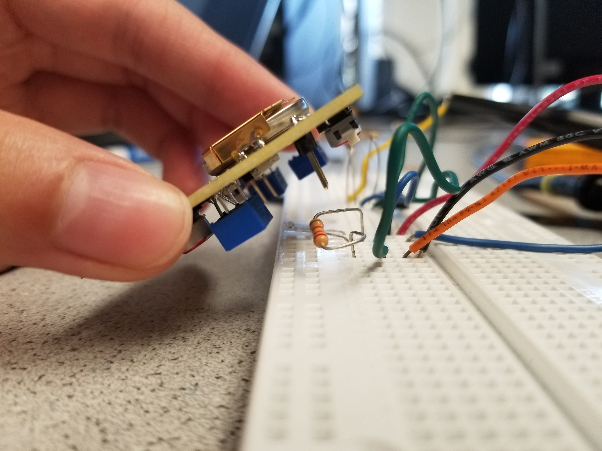 </div>
<div style="text-align:center"> 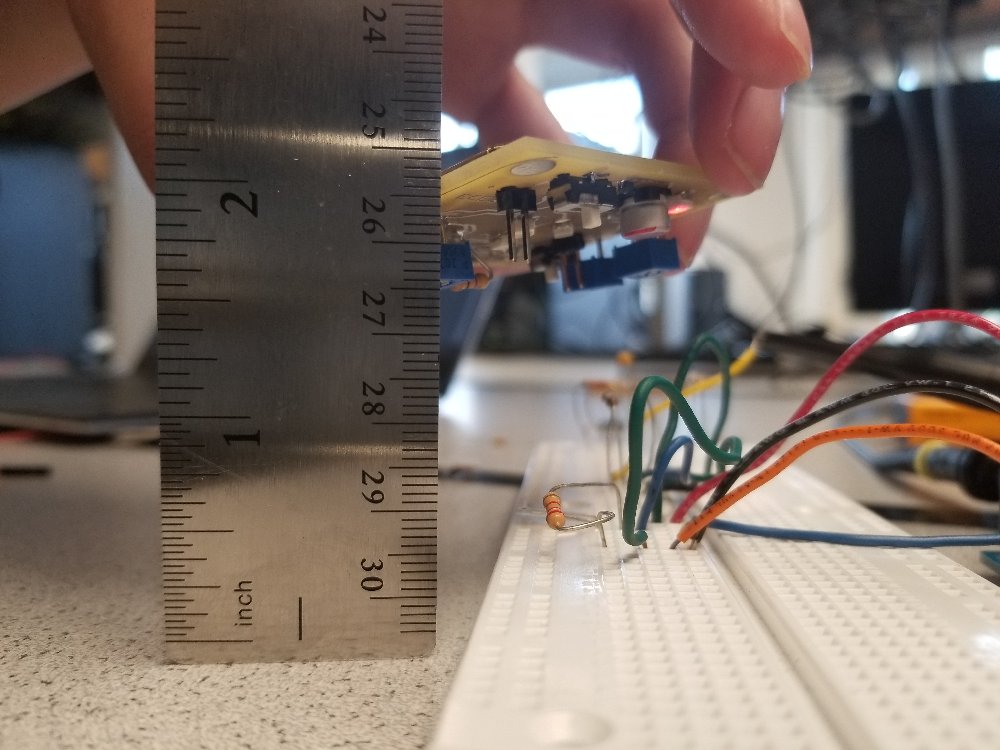 </div>
<div style="text-align:center"> 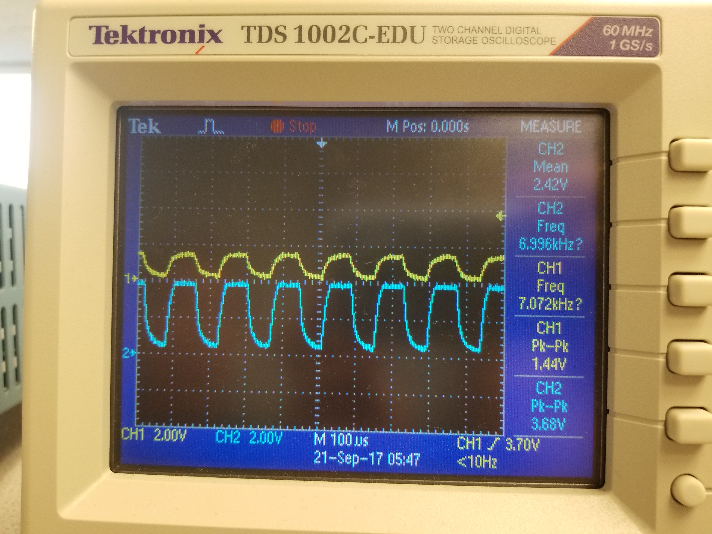 </div>
<div style="text-align:center">  </div>

### Detecting Treasure using FFT
<div style="text-align:center">  </div>
<div style="text-align:center">  </div>

### Distinguishing between 7kHz and 12kHz 

When we started assembling our circuit, we made sure to test its different
