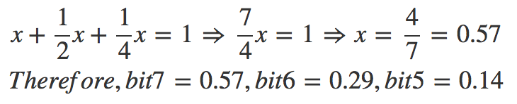
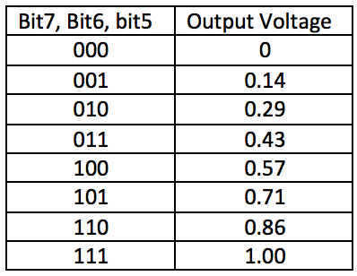
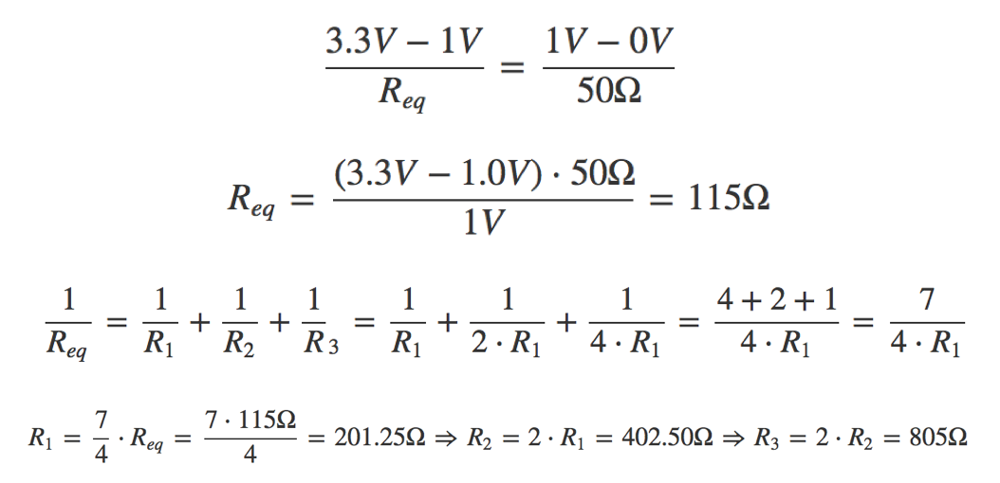
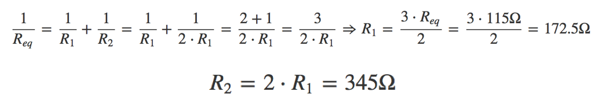
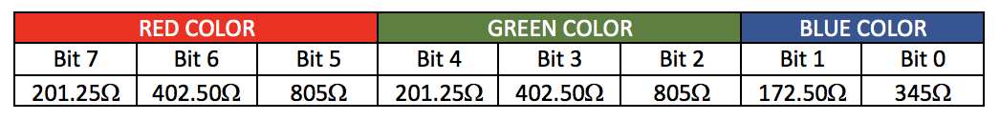
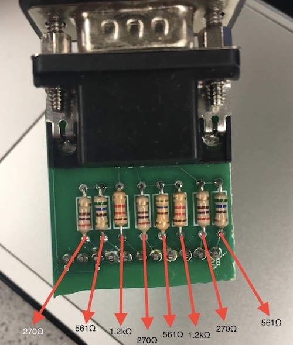
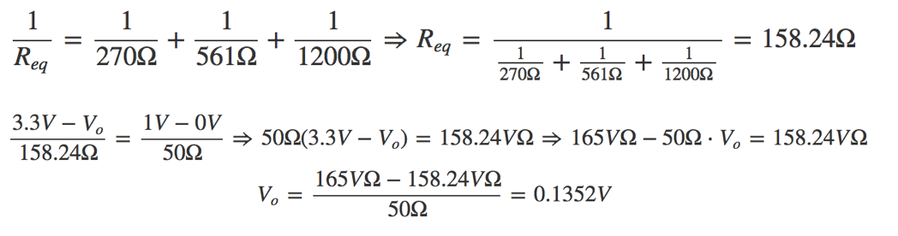
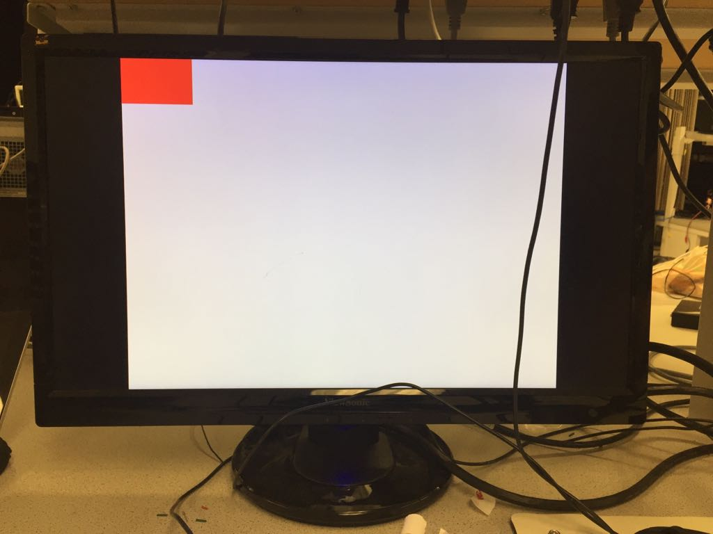
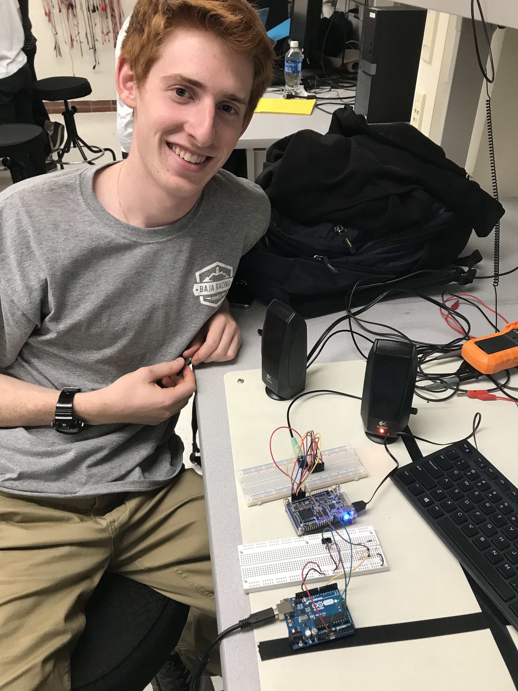

## LAB 3: FPGA Video Controller and Sound Generation

---

### Objective
This lab is divided into two. One team will take at least two external inputs to the FPGA and display them on a screen. The other team will react to an external input to the FPGA of their choice and generate a short ‘tune’ consisting of at least three tones to a speaker via an 8-bit DAC. Both of these tasks will help towards the design of the final system. In the final competition, all maze information discovered by the robot must be transmitted from the basestation Arduino to the FPGA, and then drawn on a VGA monitor. On+The next task at hand was to enable our sounds using a GPIO signal from the Arduino. The Arduino GPIO pins are 5V but the FPGA can only handle 3.3V. We used a voltage divider circuit to step the voltage down to 3.3V from 5V before connecting the pin to the FPGA board. We also added a switch to toggle the line high or low, in order to enable or disable the sound. Finally, we also had to connect the Arduino’s ground to the FPGA’s ground to ensure there was a common ground.
ce the maze has been completely mapped, the FPGA must generate a short tune to be played on a speaker to signify that the maze-mapping is done.

### Graphics Team: Juan Joel Albrecht, Christine Ou, Yazhi Fan

### Materials
* 1 VGA screen
* 1 VGA cable
* 1 VGA connector
* 1 VGA switch
* Various resistors
* 2 external switches

### Logic explanation for the screen display
The graghpics team is using a FPGA to write a VGA, or video graphics array, controller that will display graphics on the VGA monitor. An Arduino will input signals into FPGA and the FPGA will transmit VGA outputs to the monitor. The FPGA and monitor are connected by the VGA connector and the VGA cable. The FPGA outputs a VGA signal with 5 signals: horizontal sync, vertical sync, red, green, and blue. An image is generated by a electron beam canning over the screen in horizontal lines. Various colors are generated by combinations of the RGB values, which controls the strength of the electron beam.
When the screen is refreshed, one pixel is updated at a time starting from the top left corner. We are using 640 by 480 pixel mode in this lab, and we want a 60Hz refresh rate, so the clock cycle is set to 25MHz. This means that the screen will refresh 60 times in every second by updating the 640 by 480 pixel array.

### Description of how the DAC on the provided VGA connectors works and how the resistor values were chosen.
The FPGA outputs digital signals at 3.3V, while the computer reads analog signals at a range of 0-1V through the VGA port. The solution to this problem is to add a *Digital-to-Analog Converter* that can convert such signal and keep it in the desired range.

The converter we used for this case is called **R/2R DAC** and please, refer to the image below to see how it works:

<div style="text-align:center"></div>

Please, note how the blocks of series resistors following every bit input are in parallel with each other. This is a perfect mechanism since different principles help us achieve the results we wish to obtain. For instance, having an increasing *power-of-2* amount of equal resistors between will enable us to achieve different voltage values given which bit is set *HIGH* in a given color. This means, if the MSB (bit 8) is set HIGH, then a higher voltage is given to the VGA than if the LSB (bit 6) is set HIGH, since there is a much higher voltage drop after the more populated series resistance. With this idea in mind and the fact we need a voltage range between 0-1V, we arrived to the following conclusion: if all bits are set LOW (000) then VGA voltage = 0V; if all bits are set HIGH (111) then VGA voltage = 1V; any bit combination in between (001, 010, 011, etc) will just output a sum of voltages between 0V and 1V.

<div style="text-align:center"></div>

With such voltage values for each bit, we can successfully put together containing the output of the DAC
given a specific 3-bit number (in the case of red and green color):

<div style="text-align:center"></div>

Now, let's focus on the circuit presented earlier and how we can find the exact
resistor values for the DAC to behave properly. If we apply *node-voltage* on the
circuit above, we get the following calculation:

<div style="text-align:center"></div>

However, for blue, we get a different result since we have a different set up with less bits, and hence, less resistors:

<div style="text-align:center"></div>

Here, the calculations are as following:

<div style="text-align:center"></div>

Please, refer to the following table of the full results of the DAC system:

<div style="text-align:center"></div>

The calculations above provided us with the **minimum** resistor values for the output value of the DAC to be between 0V and 1V. This means that any lower impedance of the circuit would output values greater than 1V and the computer would be in trouble reading it. However, the calculation above represents the ultimate case where **111** outputs 1V. We do not exactly need that output; as long as we maintain it between 0V and 1V, we are good. Therefore, let's check that the resistors we used for the actual lab meet the requirements:
* Each resistor is approximately doubling the value of its previous bit's resistor.
* The final output of the DAC is contained within 0V and 1V.

According to this resistor-value sheet, we determined the values of the resistors we used in the lab:

<div style="text-align:center"></div>

Based on this, we calculated the resistance of each resistor and included them in this picture:

<div style="text-align:center"></div>

Nice results! We can see how the built-in resistors are actually larger than the ones we determined above, therefore the output voltage is guaranteed to be less than 1V when all bits are asserted. Now, let's see that it all properly checks out:

RED-GREEN COLOR:

<div style="text-align:center"></div>

BLUE COLOR:

<div style="text-align:center"></div>

These are the results:
* The resistors indeed -approximately- double their values according to the bit (561 ~ 270 \* 2; 1200 ~ 270 \* 4)
* The outputs voltages in both cases (0.1352V and 0.345V) are within 0V and 1V.

The results above clearly confirm our theory and our analysis on how the resistors of the DAC are chosen.

### Drawing one box on the screen
We started experimenting with the VGA by simply changing the screen color. This can be done easily by changing the RGB value that is send to the VGA driver.

```C
assign PIXEL_COLOR = 8'b111_111_11; // White
```

Then we tried to draw a box at the top corner of the screen following Team Alpha's example.

``` c
always @ (*) begin
  if(PIXEL_COORD_X < 10'd64 && PIXEL_COORD_Y < 10'd64) begin
    PIXEL_COLOR = 8'b111_000_00;
  end
  else begin
    PIXEL_COLOR = 8'b111_111_11;
  end
end
```

This code assigns color red to all pixels' whose x and y coordinates are less than decimal value 64, and it assigns color white to all other pixels.

<div style="text-align:center"></div>

### Reading external inputs to FPGA
For this part of the lab, we used two external switches in order to interact with the FPGA. We provided both switches with 3.3V from the Arduino and connected their respective outputs to specific GPIO pins in the FPGA.

<div style="text-align:center"></div>

We used the following assignment operations to be able to read from the GPIO pins:

```C
assign switch_x = GPIO_1_D[29];
assign switch_y = GPIO_1_D[25];
```

Then, we manipulated our blocks of pixels on the screen based on the readings from the variables *switch_x* and *switch_y*.

### Correctly updating a 4-bit array dependent on the inputs
For this part, we decided to create a flow system to interact all of our components: the switches, with the Arduino, and the FPGA. This time, we connected the output of the switches to two analog input pins on the Arduino. We then updated two digital output pins based on the values read from the switches: if the analog reading from the switches was higher than a 400 threshold -set by the original sample code- then we set the output signal to HIGH; else, to LOW.

```C
const int analogIn_x = A1; // analog input pin for switch 1
const int analogIn_y = A2; // analog input pin for switch 2

int value_x; // reading from input pin A1
int value_y; // reading from input pin A2

const int digitalOut_x = 5; // digital output pin for switch 1
const int digitalOut_y = 6; // digital output pin for switch 2

const int threshold = 400; // specific value set in the sample code

void setup() {
  // initialize serial communications at 9600 bps:
  Serial.begin(9600);
  pinMode(digitalOut_x, OUTPUT); // setting pin1 to output
  pinMode(digitalOut_y, OUTPUT); // setting pin2 to output
}

void loop() {
  value_x = analogRead(analogIn_x); // reading pin switch 1
  value_y = analogRead(analogIn_y); // reading pin switch 2

  // Setting it to either LOW or HIGH based on value read
  if (value_x > threshold) {
    digitalWrite(digitalOut_x, HIGH);
  } else {
    digitalWrite(digitalOut_x, LOW);
  }

  // Setting it to either LOW or HIGH based on value read
  if (value_y > threshold) {
    digitalWrite(digitalOut_y, HIGH);
  } else {
    digitalWrite(digitalOut_y, LOW);
  }

  delay(2); // small delay and keep reading
}
```

Both signals output 5V if HIGH and the DE0-Nano operates at 3.3V, therefore we needed to create two voltage dividers. For such operation, we made the calculations to determine what resistors to use and came up with the following results:

<div style="text-align:center"></div>

We then chose a 500Ω and a 1kΩ resistors to create our voltage divider. Before continuing with our process, we checked with a multimeter that the output was 3.3V: and it was, precisely, 3.297V. With the appropriate outputs set up, then we connected them to the two GPIO inputs in the FPGA and updated our *pixel_color* array accordingly. Specifically, we focused on storing appropriate values to a 4-bit, 2-by-2 array within our 4-by-4 grid. Either red or white was stored in these bits according to the combinational reading from both switches. Here is the pseudocode for it:

``` C
pixel_colors[x][y] = if switch_x == 1'b1 AND switch_y == 1'b0) then red else white
```

Please note that the piece of code from above symbolizes the assignment of a single bit; such code is included in all four bits of the block as explained in the next section.

### Mapping external inputs to four different outputs on the screen
Inside the DE0-Nano.v file, we set the following *always* block to update our pixel color in the screen in case of an external input:

``` C
reg [7:0] pixel_colors [3:0][3:0];

 always @(posedge CLOCK_25) begin
	  pixel_colors[0][0] = 8'b111_111_11; //white
	  pixel_colors[0][1] = 8'b111_111_11; //white
	  pixel_colors[0][2] = 8'b111_111_11; //white
	  pixel_colors[0][3] = 8'b111_111_11; //white
	  pixel_colors[1][0] = 8'b111_111_11; //white
	  pixel_colors[1][1] = (switch_x == 1'b0 && switch_y == 1'b0)? 8'b111_000_00:8'b111_111_11; // red OR white
	  pixel_colors[1][2] = (switch_x == 1'b0 && switch_y == 1'b1)? 8'b111_000_00:8'b111_111_11; // red OR white
	  pixel_colors[1][3] = 8'b111_111_11; //white
	  pixel_colors[2][0] = 8'b111_111_11; //white
	  pixel_colors[2][1] = (switch_x == 1'b1 && switch_y == 1'b0)? 8'b111_000_00:8'b111_111_11; // red OR white
	  pixel_colors[2][2] = (switch_x == 1'b1 && switch_y == 1'b1)? 8'b111_000_00:8'b111_111_11; // red OR white
	  pixel_colors[2][3] = 8'b111_111_11; //white
	  pixel_colors[3][0] = 8'b111_111_11; //white
	  pixel_colors[3][1] = 8'b111_111_11; //white
	  pixel_colors[3][2] = 8'b111_111_11; //white
	  pixel_colors[3][3] = 8'b111_111_11; //white
end
```

The variables *switch_x* and *switch_y*, as stated above, are read from the GPIO pins inside the FPGA. Then, we update our 16-bit two-dimensional array, specifically the block sections **[1][1]**, **[1][2]**, **[2][1]**, and **[2][2]**. These blocks represent the middle section of the 4x4 grid screen we developed. As it can be appreciated in the code above, we set up these pixels to either red (8'b111_000_00) or white (8'b111_111_11) based on the appropriate combination of the values of the switches. The following video demonstrates how the algorithm behaves to the four different combinations of the switches:

<div style="text-align: center">
<iframe width="534" height="300" src="https://www.youtube.com/embed/a1Th8jgk4mo" frameborder="0" allowfullscreen></iframe>
</div>

Refer to the following video of our final circuitry described above that combines the switches, the Arduino, and the FPGA:

<div style="text-align:center"></div>

### Acoustic Team: Eric Berg, Alex Katz
### Materials
* DE0-NANO Board
* Arduino
* 2x Breadboards
* Many jumpers
* R2R DAC
* A switch
* Speakers with 3.5mm adapter

### Generate a Square Wave Tone (without DAC)
Our first task was to generate a simple waveform by toggling a GPIO pin at a given frequency. In order to do this in verilog, we assigned a GPIO pin to a 1 bit register that is toggled  when a countdown timer reaches zero. The countdown timer value determines the frequency of the sound. We looked at Team Alpha's template code for this and implemented the same structure in order to generate a square wave. We checked our GPIO output signal on the oscilloscope and confirmed the signal was a 440Hz square wave. Then we connected the signal to our audio jack and plugged in our speakers. We successfully heard the glorious sound of a 440Hz square wave!

<div style="text-align:center"></div>
Scope with the 440Hz square wave (credit Team Alpha).


### Generate Multiple Tones (with DAC)
In order to play tones at different frequencies , we needed a way to generate a sine wave. We accomplished this using a sine table, which we generated with a simple one-liner that Alex wrote in Python. 

```python
[print("sine[{}] <= 8'd{};".format(n, int(127*math.sin(n*6.283/256))+127)) for n in xrange(0,256)]
```

The code discretizes values of a sine wave into the range 0-255. We generated 256 values. The output of the script is:

```v
sine[0] <= 8'd127;
sine[1] <= 8'd130;
...
sine[255] <= 8'd124;
```

Then we copied the output from the script into a ROM module in Verilog (Based on code from Team Alpha) :

```v
module SINE_ROM
(
  input [7:0] addr,
  input clk, 
  output reg [7:0] q
);
   // The ROM
  reg [7:0] sine[628:0];

  initial
  begin
    sine[0] <= 8'd127;
    sine[1] <= 8'd130;
    ...
    sine[255] <= 8'd124;
  end

  // Read out the value at addr
  always @ (posedge clk)
  begin
    q <= sine[addr];
  end
endmodule
``` 

<div style="text-align:center"></div>

In order change the tone we were outputting, we only had to change the frequency at which we read the sine table. For this lab we had three frequencies: 245Hz, 490Hz and 735Hz. We wired GPIO_1_[0:7] to the inputs of our DAC, and connected the output of the DAC to the speaker. Our code is below. We got the general structure from Team Alpha's code. Our code below also incorporates the enable/disable signal from the Arduino. The switch is connected to GPIO_1_D[8], as described in the next section. 

```v
 // Generate 25MHz clock for VGA, FPGA has 50 MHz clock
always @ (posedge CLOCK_50) begin
  CLOCK_25 <= ~CLOCK_25; 
end // always @ (posedge CLOCK_50)
	
// Logic for generating the tones
always @ (posedge CLOCK_25) begin
  tone_index = GPIO_1_D[8] ? tone_index : 2'd3;
  if (counter == 0) begin //when reach 0, increment table index
    case(tone_index) //change frequency depending on tone
      2'd0: counter <= CLKDIVIDER_245HZ - 1; 	//tone 1
      2'd1: counter <= CLKDIVIDER_245HZ/2 - 1;  //tone 2
      2'd2: counter <= CLKDIVIDER_245HZ/3 - 1;  //tone 3
      2'd3: counter <= 0;			//no tone
    endcase
    table_index <= table_index + 1; //increase table index (go through sine table)
  endWe
  else begin
    counter <= counter - 1; // countdown
  end
  //cycle through tones
  if (tone_dur == 0) begin                      //when reach 0, increment tone index
    tone_dur <= ONE_SEC - 1;                    // reset tone
    tone_index <= tone_index + 1;               //change tone every second
  end
  else begin
    tone_dur <= tone_dur - 1; // countdown
  end
end		 
```
<div style="text-align:center"></div>

### Use Arduino  to Enable/Disable Sound
The next task at hand was to enable our sounds using a GPIO signal from the Arduino. The Arduino GPIO pins are 5V but the FPGA can only handle 3.3V. We used a voltage divider circuit to step the voltage down to 3.3V from 5V before connecting the pin to the FPGA board. We also added a switch to toggle the line high or low, in order to enable or disable the sound. Finally, we also had to connect the Arduino’s ground to the FPGA’s ground to ensure there was a common ground.

Then we had to implement the reading of the Arduino signal in Verilog to allow or not allow sounds to play. As seen in the code below, we added a 4th case in our tone_index case statement to represent no tone. We implemented no tone by setting the counter equal to 0, which means the sine table is read at the clock frequency of 25MHz, which can not be audibly heard. Every time the switch is flipped on, the signal is raised high and the tone index is set to no tone using a ternary operator. 
Below is a video of all 3 tones playing and the waveforms shown of each tone. When the switch is flipped all sounds stops. 

<iframe width="560" height="315" src="https://www.youtube.com/embed/Z51QBP8-iao" frameborder="0" allowfullscreen></iframe>
