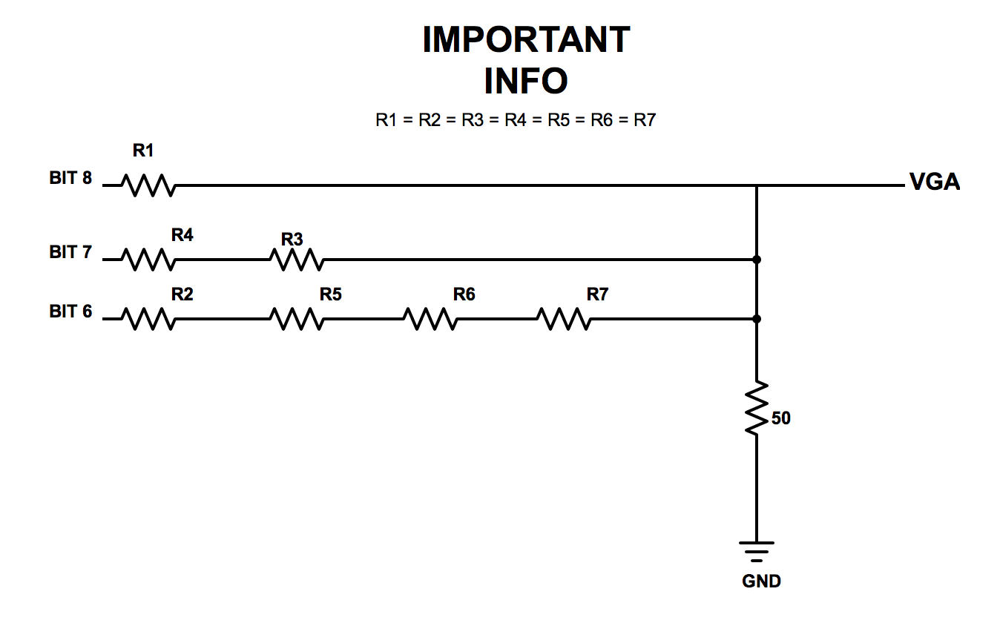
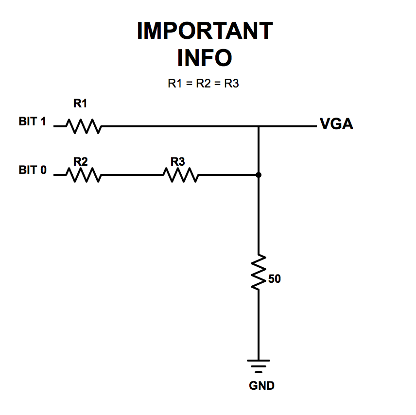
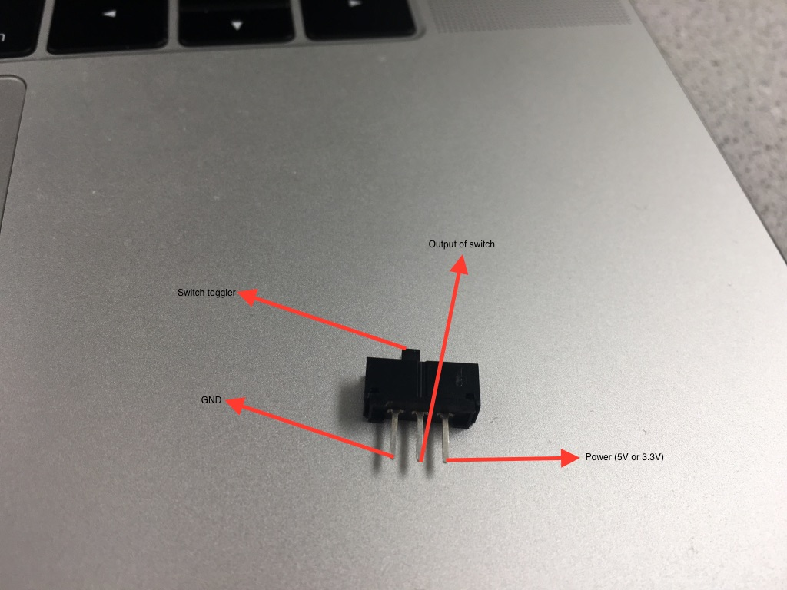
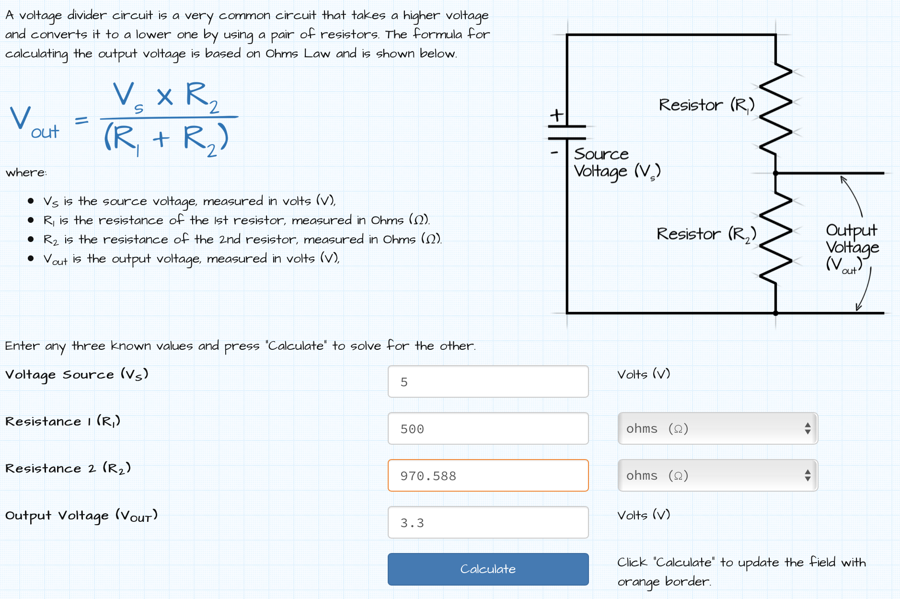
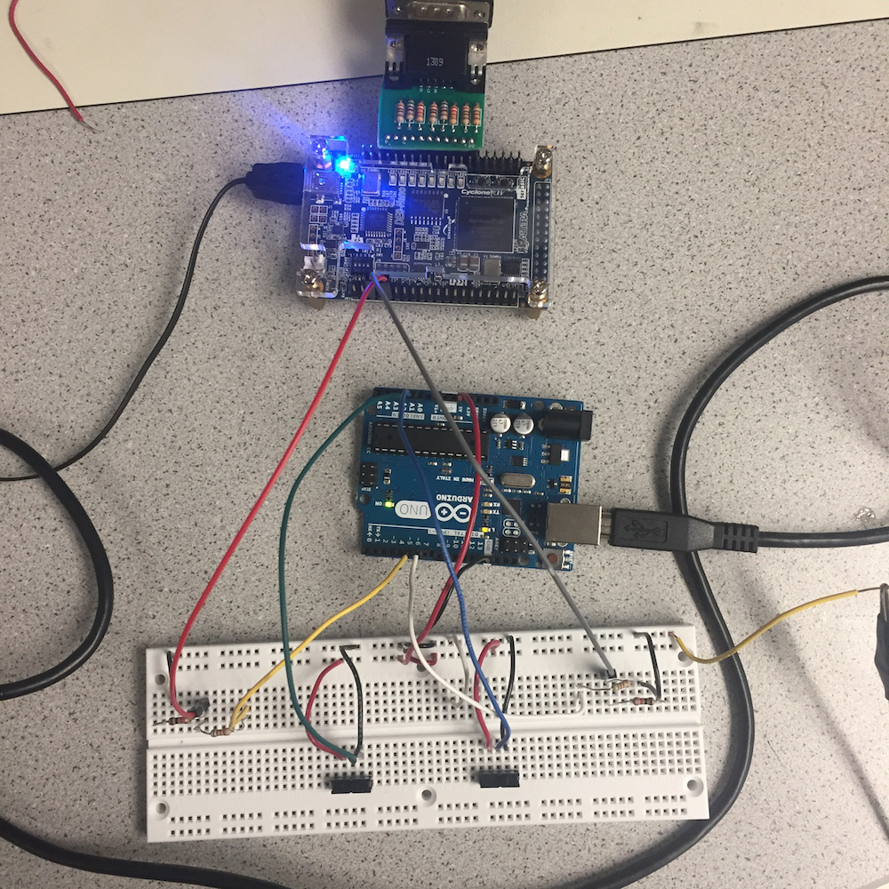

## LAB 3: FPGA Video Controller and Sound Generation

---

### Objective
This lab is divided into two. One team will take at least two external inputs to the FPGA and display them on a screen. The other team will react to an external input to the FPGA of their choice and generate a short ‘tune’ consisting of at least three tones to a speaker via an 8-bit DAC. Both of these tasks will help towards the design of the final system. In the final competition, all maze information discovered by the robot must be transmitted from the basestation Arduino to the FPGA, and then drawn on a VGA monitor. Once the maze has been completely mapped, the FPGA must generate a short tune to be played on a speaker to signify that the maze-mapping is done.

### Graphics Team: Juan Joel Albrecht, Christine Ou, Yazhi Fan

### Materials
* 1 VGA screen
* 1 VGA cable
* 1 VGA connector
* 1 VGA switch
* Various resistors
* 2 external switches

### Logic explanation for the screen display
The graghpics team is using a FPGA to write a VGA, or video graphics array, controller that will display graphics on the VGA monitor. An Arduino will input signals into FPGA and the FPGA will transmit VGA outputs to the monitor. The FPGA and monitor are connected by the VGA connector and the VGA cable. The FPGA outputs a VGA signal with 5 signals: horizontal sync, vertical sync, red, green, and blue. An image is generated by a electron beam canning over the screen in horizontal lines. Various colors are generated by combinations of the RGB values, which controls the strength of the electron beam.
When the screen is refreshed, one pixel is updated at a time starting from the top left corner. We are using 640 by 480 pixel mode in this lab, and we want a 60Hz refresh rate, so the clock cycle is set to 25MHz. This means that the screen will refresh 60 times in every second by updating the 640 by 480 pixel array.

### Description of how the DAC on the provided VGA connectors works and how the resistor values were chosen.
The FPGA outputs digital signals at 3.3V, while the computer reads analog signals at a range of 0-1V through the VGA port. The solution to this problem is to add a *Digital-to-Analog Converter* that can convert such signal and keep it in the desired range.

The converter we used for this case is called **R/2R DAC** and please, refer to the image below to see how it works:

<div style="text-align:center"></div>

This is a perfect mechanism since different principles help us achieve the results we wish to obtain. For instance, having an increasing *power-of-2* amount of equal resistors between will enable us to achieve different voltage values given which bit is set *HIGH* in a given color. This means, if the MSB (bit 8) is set HIGH, then a higher voltage is given to the VGA than if the LSB (bit 6) is set HIGH, since there is a much higher voltage drop after the more populated series resistance. With this idea in mind and the fact we need a voltage range between 0-1V, we arrived to the following conclusion: if all bits are set LOW (000) then VGA voltage = 0V; if all bits are set HIGH (111) then VGA voltage = 1V. If we apply *node-voltage* on the circuit above, we get the following calculation:

\frac{3.3V - 1V}{R_{eq}} = \frac{1V - 0V}{50\Omega}

Given the result of the calculations above, our resistor values are:
RED ->
GREEN ->

However, for blue, we get a different result since we have a different set up with less bits, and hence, less resistors:

<div style="text-align:center"></div>

Here, the calculations are as following:

*image*

And the resistor values we obtain are R1 = ? and R2 = ?.

Please, refer to the following table of the full results of the DAC system:

*table*

### Drawing one box on the screen
We started experimenting with the VGA by simply changing the screen color. This can be done easily by changing the RGB value that is send to the VGA driver.
``` c
assign PIXEL_COLOR = 8'b111_111_11; //White
```
Then we tried to draw a box at the top corner of the screen following Team Alpha's example.
``` c
always @ (*) begin
  if(PIXEL_COORD_X < 10'd64 && PIXEL_COORD_Y < 10'd64) begin
    PIXEL_COLOR = 8'b111_000_00;
  end
  else begin
    PIXEL_COLOR = 8'b111_111_11;
  end
end
```
This code assigns color red to all pixels' whose x and y coordinates are less than decimal value 64, and it assigns color white to all other pixels.


### Reading external inputs to FPGA
For this part of the lab, we used two external switches in order to interact with the FPGA. We provided both switches with 3.3V from the Arduino and connected their respective outputs to specific GPIO pins in the FPGA.

<div style="text-align:center"></div>

We used the following assignment operations to be able to read from the GPIO pins:

``` c
assign switch_x = GPIO_1_D[29];
assign switch_y = GPIO_1_D[25];
```

Then, we manipulated our blocks of pixels on the screen based on the readings from the variables *switch_x* and *switch_y*.

### Correctly updating a 4-bit array dependent on the inputs
For this part, we decided to create a flow system to interact all of our components: the switches, with the Arduino, and the FPGA. This time, we connected the output of the switches to two analog input pins on the Arduino. We then updated two digital output pins based on the values read from the switches: if the analog reading from the switches was higher than a 400 threshold -set by the original sample code- then we set the output signal to HIGH; else, to LOW.

```c
const int analogIn_x = A1; // analog input pin for switch 1
const int analogIn_y = A2; // analog input pin for switch 2

int value_x; // reading from input pin A1
int value_y; // reading from input pin A2

const int digitalOut_x = 5; // digital output pin for switch 1
const int digitalOut_y = 6; // digital output pin for switch 2

const int threshold = 400; // specific value set in the sample code

void setup() {
  // initialize serial communications at 9600 bps:
  Serial.begin(9600);
  pinMode(digitalOut_x, OUTPUT); // setting pin1 to output
  pinMode(digitalOut_y, OUTPUT); // setting pin2 to output
}

void loop() {
  value_x = analogRead(analogIn_x); // reading pin switch 1
  value_y = analogRead(analogIn_y); // reading pin switch 2

  // Setting it to either LOW or HIGH based on value read
  if (value_x > threshold) {
    digitalWrite(digitalOut_x, HIGH);
  } else {
    digitalWrite(digitalOut_x, LOW);
  }

  // Setting it to either LOW or HIGH based on value read
  if (value_y > threshold) {
    digitalWrite(digitalOut_y, HIGH);
  } else {
    digitalWrite(digitalOut_y, LOW);
  }

  delay(2); // small delay and keep reading
}
```

Both signals output 5V if HIGH and the DE0-Nano operates at 3.3V, therefore we needed to create two voltage dividers. For such operation, we made the calculations to determine what resistors to use and came up with the following results:

<div style="text-align:center"></div>

We then chose a 500Ω and a 1kΩ resistors to create our voltage divider. Before continuing with our process, we checked with a multimeter that the output was 3.3V: and it was, precisely, 3.297V. With the appropriate outputs set up, then we connected them to the two GPIO inputs in the FPGA and updated our *pixel_color* array accordingly. Specifically, we focused on storing appropriate values to a 4-bit, 2-by-2 array within our 4-by-4 grid. Either red or white was stored in these bits according to the combinational reading from both switches. Here is the pseudocode for it:

``` c
pixel_colors[x][y] = if switch_x == 1'b1 AND switch_y == 1'b0) then red else white
```

Please note that the piece of code from above symbolizes the assignment of a single bit; such code is included in all four bits of the block as explained in the next section.

### Mapping external inputs to four different outputs on the screen
Inside the DE0-Nano.v file, we set the following *always* block to update our pixel color in the screen in case of an external input:

``` c
reg [7:0] pixel_colors [3:0][3:0];

 always @(posedge CLOCK_25) begin
	  pixel_colors[0][0] = 8'b111_111_11; //white
	  pixel_colors[0][1] = 8'b111_111_11; //white
	  pixel_colors[0][2] = 8'b111_111_11; //white
	  pixel_colors[0][3] = 8'b111_111_11; //white
	  pixel_colors[1][0] = 8'b111_111_11; //white
	  pixel_colors[1][1] = (switch_x == 1'b0 && switch_y == 1'b0)? 8'b111_000_00:8'b111_111_11; // red OR white
	  pixel_colors[1][2] = (switch_x == 1'b0 && switch_y == 1'b1)? 8'b111_000_00:8'b111_111_11; // red OR white
	  pixel_colors[1][3] = 8'b111_111_11; //white
	  pixel_colors[2][0] = 8'b111_111_11; //white
	  pixel_colors[2][1] = (switch_x == 1'b1 && switch_y == 1'b0)? 8'b111_000_00:8'b111_111_11; // red OR white
	  pixel_colors[2][2] = (switch_x == 1'b1 && switch_y == 1'b1)? 8'b111_000_00:8'b111_111_11; // red OR white
	  pixel_colors[2][3] = 8'b111_111_11; //white
	  pixel_colors[3][0] = 8'b111_111_11; //white
	  pixel_colors[3][1] = 8'b111_111_11; //white
	  pixel_colors[3][2] = 8'b111_111_11; //white
	  pixel_colors[3][3] = 8'b111_111_11; //white
end
```

The variables *switch_x* and *switch_y*, as stated above, are read from the GPIO pins inside the FPGA. Then, we update our 16-bit two-dimensional array, specifically the block sections **[1][1]**, **[1][2]**, **[2][1]**, and **[2][2]**. These blocks represent the middle section of the 4x4 grid screen we developed. As it can be appreciated in the code above, we set up these pixels to either red (8'b111_000_00) or white (8'b111_111_11) based on the appropriate combination of the values of the switches. The following video demonstrates how the algorithm behaves to the four different combinations of the switches:

*video 1*

Refer to the following video of our final circuitry described above that combines the switches, the Arduino, and the FPGA:

<div style="text-align:center"></div>

### Acoustic Team: Eric Berg, Alex Katz
