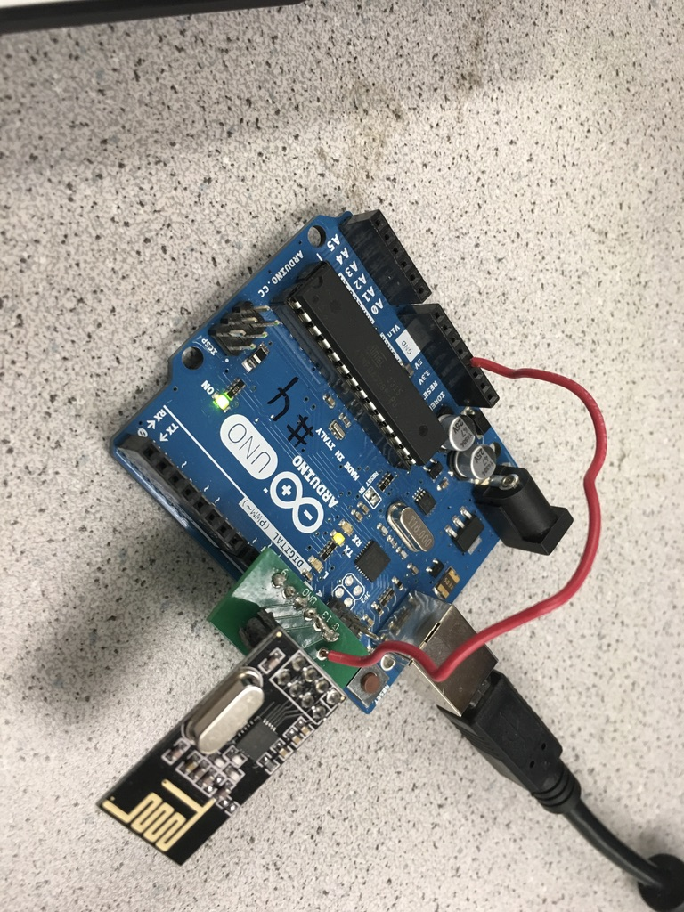
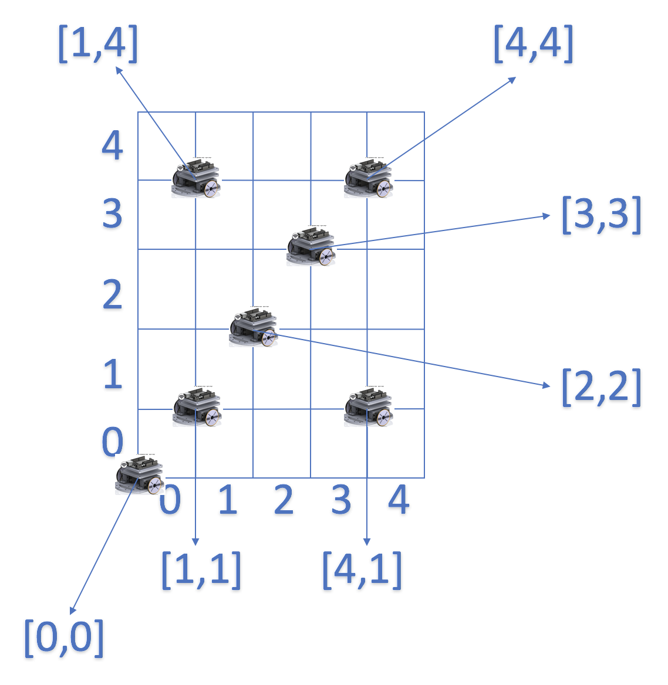
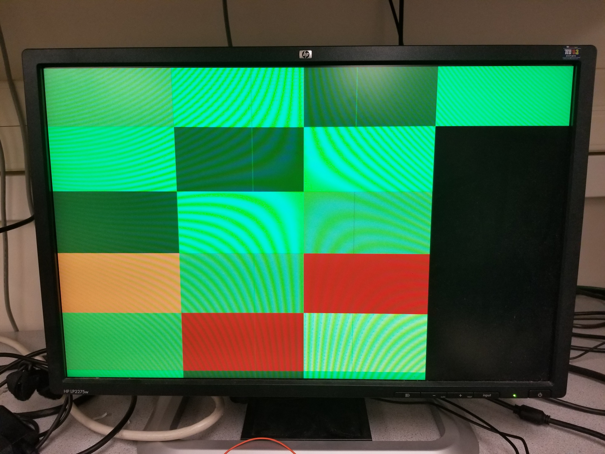

## LAB 4: Radio Communication and Map Drawing

---

### Objective
One group will work on the radio component and the other on the FPGA component. For the final portion of the lab, the work done with the radio will be combined with the work done with the FPGA. Using the Nordic nRF24L01+ transceivers and the corresponding Arduino RF24 library, you will get the robot and video controller to talk to each other. You should ideally be able to send messages from one Arduino to the other Arduino (simulating actual maze information) and have the FPGA display the received data on the monitor.

### Radio Team: Juan Joel Albrecht, Christine Ou, Yazhi Fan

### Materials
* 2 Nordic nRF24L01+ transceivers
* 2 Arduino Unos (one must be shared with the other sub-team)
* 2 USB A/B cables
* 2 radio breakout boards with headers

### Wireless Communication
When trying to set up our circuit, we gathered all the materials and assembled both Arduinos with the *radio boards* and the already board-printed Nordic nRF24L01+ transceivers. Then we adjusted the values of the pipes based on our team characteristics and we obtained the following statement:

```C
// Radio pipe addresses for the 2 nodes to communicate with addresses 30 and 31
const uint64_t pipes[2] = { 0x000000001ELL, 0x000000001FLL };
```

Then we proceeded to program our Arduinos with the correct pipes and went on to test our transmission process. We decided to use two different computers in order to be more comfortable reading both serial ports at the same time. On the transmitter Arduino, we set the baud rate to 57600 according to the setup() function provided in *GettingStarted* and typed "T" into the Serial port. On the other end, the receiving Arduino was properly setup as well with a baud rate of 57600 and it was ready to receive packets from the transmitter. We then started playing around with distance to see how the dropped packets were starting to appear, what was the maximum distance before getting complete miscommunication between the Arduinos, and how AKC was working in these particular cases. After moving **710 cm** apart from each other we started to see how we were having dropped packets -this is way more than what we actually need-, alerted by the text *"Failed, response timed out"*. We then started thinking: in any case where the sent information is not complete, the next packet uses its first information blocks to fill the incomplete initial packet which is then analyzed. This is obviously wrong, but we receive a nice output saying that we have a dropped packet instead of continuing with the failing process described above. This is because the feature Auto-ACK inside RF24 is enabled by default: **a signal passed between communicating processes, computers, or devices to signify acknowledgement, or receipt of message, as part of a communications protocol.** This lets us not worry about failing packets, but we then need to worry about re-sending failing data. Finally, we perceived some interference not only when separating the Arduinos far enough, but when covering the radios with our hands.

This is a picture of the final hardware setup:

<div style="text-align:center"></div>

#### Transmitter Side
For the transmitter Arduino, we found the code inside *GettingStarted* very useful and we utilized it throughout the entire lab with a few modifications based on the task we were trying to accomplish. This is the initial setup we used to transmit packets to the receiver Arduino:

```C
if (role == role_ping_out)
  {
    // First, stop listening so we can talk.
    radio.stopListening();

    // Take the time, and send it.  This will block until complete
    unsigned long time = millis();
    printf("Now sending %lu...",time);
    bool ok = radio.write( &time, sizeof(unsigned long) );

    if (ok)
      printf("ok...");
    else
      printf("failed.\n\r");

    // Now, continue listening
    radio.startListening();

    // Wait here until we get a response, or timeout (250ms)
    unsigned long started_waiting_at = millis();
    bool timeout = false;
    while ( ! radio.available() && ! timeout )
      if (millis() - started_waiting_at > 200 )
        timeout = true;

    // Describe the results
    if ( timeout )
    {
      printf("Failed, response timed out.\n\r");
    }
    else
    {
      // Grab the response, compare, and send to debugging spew
      unsigned long got_time;
      radio.read( &got_time, sizeof(unsigned long) );

      // Spew it
      printf("Got response %lu, round-trip delay: %lu\n\r",got_time,millis()-got_time);
    }

    // Try again 1s later
    delay(1000);
  }
```

According to the code above, the transmitter Arduino sends the current time -in order to have a variable output- to the receiver and stores the output of the process in a **bool** variable called *ok*. This variable, which has Auto-ACK enabled by default, sends confirmation that the information was sent correctly. Then, with the line ```radio.startListening();```, the receiver starts listening for the receiver's approval that it received the information on time. It then prints a message to the screen saying if the operation was successful or if it timed out due to different issues.

#### Receiver Side
```C
if ( role == role_pong_back )
  {
    // if there is data ready
    if ( radio.available() )
    {
      // Dump the payloads until we've gotten everything
      unsigned long got_time;
      bool done = false;
      while (!done)
      {
        // Fetch the payload, and see if this was the last one.
        done = radio.read( &got_time, sizeof(unsigned long) );

        // Spew it
        printf("Got payload %lu...",got_time);

        // Delay just a little bit to let the other unit
        // make the transition to receiver
        delay(20);

      }

      // First, stop listening so we can talk
      radio.stopListening();

      // Send the final one back.
      radio.write( &got_time, sizeof(unsigned long) );
      printf("Sent response.\n\r");

      // Now, resume listening so we catch the next packets.
      radio.startListening();
    }
  }
```
The receiver part of this code checks for available radio and fetch it if it is available. After we’ve gotten the last payload, the receiver stops listening with ```radio.stopListening()```. While listening is paused, it sends back a signal so that the transmitter knowns that the information has been sent successfully. After that, the receiver starts listening again for new radio signals.

### Sending the entire maze wirelessly
In order to send the entire maze wirelessly to the other Arduino, we needed to come up with a system to clearly identify the different states of each box in the grid. We then agreed that there were *four* possible states for a box to be in: unvisited, no wall (but visited), wall, and treasure presence. Since we only have four, we assigned the following values of type ```char``` to them: unvisited = 0; no wall = 1; wall = 2; treasure = 3. We will the explain how four possibilities is a wonderful number after all. To send an entire grid, we created a 5x5 "space" composed of the types described above. Of course, this will be adjusted by the day of the final competition where the grid is 4x5, but for the sake of this lab, we wanted to create a square structure for easy visibility and operation. Such 2-dimensional array of unsigned characters was used to send in a single payload; since the size of a ```char``` is 1 byte, we then are sending 25 bytes worth of information. The default size of a payload is 32 bytes, so we can safely send this information in a single payload.

#### Transmitter Side
This is an example of the 2-dimensional array we initially used to send the information:

```C
unsigned char our_maze[5][5] =
{
2, 1, 0, 1, 0,
0, 1, 2, 1, 3,
1, 2, 0, 3, 2,
3, 1, 2, 1, 3,
0, 3, 3, 1, 0,
};
```

This array was included as part of our code for the transmitter Arduino, accompanied by the following new code which sends information and reads the feedback from the receiver. However, it has a few different alterations since the type we are now sending is different:

```C
// Send the maze in a single payload
printf("Wait, the maze is being sent ...\!\n");
bool ok = radio.write( our_maze, sizeof(our_maze) );

if (ok)
  printf("The maze was sent successfully\!");
else
  printf("An error occurred.\n\r");

// Now, continue listening
radio.startListening();
```

This code works the same as above with the only difference that it is now sending a 25-byte array of data that is being analyzed by the receiver Arduino.

#### Receiver Side
The receiver side is responsible for reading the maze. Then it will print the maze on serial monitor so that we known it has received all the information successfully.
```C
unsigned char our_maze[5][5];
bool done = false;
while (!done)
{
  // Fetch the payload.
  done = radio.read( our_maze, sizeof(got_maze) );

  // Print the maze
  for (int i=0; i < 5; i++) {
    for (int j=0; j < 5; j++) {
      printf("%d ", our_maze[i][j]);
    }
    printf("\n");
  }

  // Delay just a little bit to let the other unit
  // make the transition to receiver
  delay(20);

}
```
The receiver code first declares a 5x5 array. After it fetches the payload, the information will be store in the **our_maze** array. Then it prints the array row by row onto serial monitor.

#### Partial Conclusion
In this case, the Arduinos are interchanging information that is worth 25-byte of data. Although it is perfectly allowed to do since it falls within our range (~32-byte), this is a very dangerous tactic to use because of the huge size of the information. It can be easily fragmented due to interference and although the Auto-ACK feature helps us reject incomplete information, we then have to send it again and may lose a lot of time when providing a live status of the robot and the maze.

### Sending New Information Only
Following up on the statement made above, we decided sending new information only would be a better idea for our project. It not only improves in time efficiency, but also avoids sending huge packets of data like before. We then decided to establish the following format: since we have a 5x5 grid and 4 different types of "box" status, we analyzed that all 5 rows/columns could be represented with a 3-bit signal, while the states variables can be represented with a 2-bit signal -hence why 4 states was very nice to use-. We then have 3+3+2 bits which is 8 bits or 1 byte. Perfect! We came up with an alternative solution of sending new information of size 1-byte instead of sending continuous 25-bytes packets. We structured the bit distribution this way: the first 3-bits correspond to the x-coordinate of the maze; second 3-bits correspond to the y-coordinate of the maze; last 2-bits correspond to the state of the specific box at the xy-coordinate. Such information would have to be parsed by the receiver Arduino into these three different components in order to then update the maze accordingly. However, in order for all of this to work efficiently, the receiver side should now have the original 2-D array in its part instead of having the transmitter send the entire 25-bytes at the beginning. For the purpose of our project, such array *maze* should be initialized to 0 in all indexes, meaning it has not been visited yet -which is what we want-. This idea also helps the flow of the communication and avoids sending big data at all.

#### Transmitter Side
We found the code provided by Team Alpha very useful and straight forward and after carefully analyzing it, we decided to go with this algorithm for now.

```C
unsigned char new_data;
// Pack the bits in this pattern
// x_coord | y_coord | state
// 3 bits  | 3 bits  | 2 bits

// Test data
unsigned char x_coord = 2;
unsigned char y_coord = 3;
unsigned char pos_state = 1;

// Use bit shifting to pack the bits
// For deployment with a robot, something like this should be factored out into
// a function, along with the code to unpack the bits
new_data = x_coord << 5 | y_coord << 2 | pos_state;
// For the test case of (5, 5, 3) the byte shoud look like: 10010011
// In decimal this is 147

// Take the time, and send it.  This will block until complete
printf("Now sending new map data\n");
bool ok = radio.write( &new_data, sizeof(unsigned char) );

if (ok)
  printf("ok...");
else
  printf("failed.\n\r");

// Now, continue listening
radio.startListening();
```

The important piece of information here is how bit shifting was used to transform data of type ```char``` from the variables **x_coord**, **y_coord**, and **pos_state** into an 8-bit number. Here is how it works:

The value of x_coord is 2 or 010 in binary. The operation x_coord << 5 shifts the 3-bits of x_coord to the left times 5, obtaining the 8-bit number 01000000. A similar thing happens with y_coord which has a value of 3 or 011 and is shifted to the left 2 times. This results in the 5-bit number 01100; however, if we apply sign extension to it, we can get the 8-bit number 00001100, which is also equivalent to what we had before. The value of pos_state is 1 or 01, which is then sign extended to 8-bit 00000001. The final operation is to convert them all into a single 8-bit number containing the "sum" of their bits. This is accomplished by using a **OR \|** operator on them like **X \| Y \| Z**. The output of such operation assigns the bits in the order we want and creates a valid 8-bit number that represents the correct information.

#### Receiver Side
The receiver Arduino is responsible for getting the packet and parse the packet for useful information.

```C
if ( role == role_pong_back )
{
  unsigned char got_data;
  bool done = false;
  unsigned char x_coord;
  unsigned char y_coord;
  unsigned char pos_data;

while (!done)
{
  // Fetch the payload, and see if this was the last one.
  done = radio.read( &got_data, sizeof(unsigned char) );

  // Parse new data
  x_coord= (got_data & 0b11100000) >> 5;
  y_coord= (got_data & 0b00011100) >> 2;
  pos_data= (got_data & 0b00000011);
  got_maze[x_coord][y_coord] = pos_data;

  // Delay just a little bit to let the other unit
  // make the transition to receiver
  delay(20);

}
// if there is data ready
if ( radio.available() )
{
  // Print the maze
  for (int i=0; i < 5; i++) {
  for (int j=0; j < 5; j++) {
  printf("%d ", got_maze[i][j]);
}
printf("\n");
}

// Delay just a little bit to let the other unit
// make the transition to receiver
delay(20);

printf("\n");
}
}
```

The first step in converting the 8-bit packet to useful information about the maze is and operation. To get the x coordinate, we perform and operation on the 8-bit number with 11100000 to get the 3 most significant bits. Then we right shift it 5 times to get the 3-bit information. Then we perform similar operations on the next 3 bits to get the y coordinate, and the last 2 bits to get the position data. After getting all the information, we update the position in the maze matrix corresponding to the x and y coordinate with the position data using the line```got_maze[x_coord][y_coord] = pos_data;```. In the end, we print the state of the entire maze to make sure it is updated correctly. The updating result can been seen on the serial monitor.

#### Partial Conclusion
To test our algorithm to update the maze, we created an array of data to be used. Such data contained 5 different x-coordinates, y-coordinates, and states. The final objective was to update the diagonals of the 5x5 maze -having a square array has its perks after all- using these values. Here is the code used:

```C
unsigned char new_data;

unsigned char x_coord[5] = {0, 1, 2, 3, 4};
unsigned char y_coord[5] = {1, 1, 2, 3, 4};
unsigned char pos_state[5] = {1, 2, 1, 2, 3};

new_data = x_coord[count % 5] << 5 | y_coord[count % 5] << 2 | pos_state[count % 5];

count++;
```

We used the *module %* operator in order to maintain the accessible indexes of the array between 0 and 4, avoiding going out-of-bounds. This *new_data* is then sent to the receiver, analyzed and updated over there.

Please, see how the updating process behaved using this algorithm and the new data to be changed:

<div style="text-align: center">
<iframe width="534" height="300" src="https://www.youtube.com/embed/4sRViZqCjYg" frameborder="0" gesture="media" allowfullscreen></iframe>
</div>
### Updating the maze array, dependent only on the updated robot information
To update the robot's position, we came up with a naming standard to use the different xy-coordinates of the 5x5 boxes of the grid to locate a corner position for the robot. We the decided on the following idea: the x-coordinate position of the robot in the intersection lines would be the same as the number of the immediate box to its left; the y-coordinate position of the robot in the intersection lines would be the same as the number of the immediate box to its north direction. Please, refer to the following picture to see what we mean by this:

<div style="text-align:center"></div>

This idea enables to not only change the current state of the maze by providing new information only about the new state, but to also send the robot's position in that packet. It is a win-win for the team! This entire idea is being deeply analyzed by the FPGA team and they are the ones that actually put this convention into practice.

### FPGA Team: Eric Berg, Alex Katz

### Materials
* FPGA
* 1 Arduino Uno
* 1 VGA cable
* 1 VGA connector
* 1 VGA switch
* Resistors

### Displaying a full 4-by-5 grid array on the screen
We modified our code from lab 3 to display a representation of the 4x5 grid maze. The screen is 640 by 480 pixels so we divided the x coordinate by 160 to get 4 divisions and y coordinate by 96 to get 5 divisions.
```C
PIXEL_COLOR = pixel_colors[PIXEL_COORD_X/8'd160][PIXEL_COORD_Y/8'd96]
```

<div style="text-align:center"></div>

Then we updated the color of the visited block using the formula 
```C
pixel_colors[pixel_y][pixel_x] = pixel_y * 20 + pixel_x * 20;
```

which we decided on just so that we could make sure each pixel was updating correctly. We got the display to work correctly using a for loop in verilog, however when we tried reading the information from the arduino in real-time, we ran into a few issues (as you can see from the grid above, which was generated using communication from the arduino). Our main issue was that we were accidentally using a GPIO pin twice in our Arduino code so when we tried our parallel communication protocol with the FPGA, not all the pins functioned as expected, and many of the values were incorrect. Unfortunately we only realized this at the end of lab, and didn't have time to debug any other issues. 

Below is a video showing successful parallel communication between the Arduino and FPGA. Because we could not get the display to update properly, we instead used the onboard LEDS to display the data values. The first two LEDs are the 2 bits that make up the row position and the next three LEDs are the 3 bits that make up the column position. Our Arduino code runs through each column and each row position by toggling the GPIO’s low and high according to the binary number that describes the position on the grid.

### Communicating maze information from the Arduino to the FPGA

In order to communicate the radio-received data from the Arudino to the FPGA, we first attempted to transmit data via SPI. Our first step was to write Arduino code to transmit a byte of SPI using Arudino's SPI library. Then we confirmed the SPI output on the oscilloscope by checking the CLK, MOSI, and CS lines individually. Our SPI signal counted from 0-9 continously. The waveform on the oscilloscope correctly refelcted the data transmission. Then we began writing Verilog code to interpret the SPI signal on 3 GPIO pins. Below is our code for interpreting SPI that did not work correctly. Our main issue was flagging when the SPI_data_buffer was full, in order to know when to write the pixel to the display.

```V
wire spi_sck;
	wire spi_cs;
	wire spi_mosi;
	
	assign spi_sck  = GPIO_1_D[1];
	assign spi_cs   = GPIO_1_D[2];
	assign spi_mosi = GPIO_1_D[3];
	assign GPIO_1_D[4] = spi_mosi;
 ```


```V
always @(posedge CLOCK_25) begin
		if(spi_cs & spi_rx_done_writing) begin
			spi_rx_done_reading = 1'b0;
			pixel_x = (8'b11100000 & spi_rx_buf) >> 5;
			pixel_y = (8'b00011100 & spi_rx_buf) >> 2;
			pixel_colors[pixel_y][pixel_x] = pixel_x * 10 + pixel_y * 10;
			spi_rx_done_reading = 1'b1;
		end
	end
	
	always @(negedge spi_sck or posedge spi_rx_done_reading) begin
		if(!spi_cs) begin 
			spi_rx_done_writing = 1'b0;
			spi_rx_buf = spi_rx_buf | (spi_mosi << data_pos);
			data_pos = data_pos - 3'd1;
		end
		else if(spi_rx_done_reading) begin
			spi_rx_buf = 8'd0;
			data_pos = 3'd7;
		end
		if(data_pos == 3'd0) begin
			spi_rx_done_writing = 1'b1;
		end
	end
  ```
  
After troubleshooting SPI for some more time unsuccessfully, we moved over to data transmission via parallel GPIO lines. We used 5 wires to transmit the x-position (3 bits) and y-position (2 bits) of the robot. We wrote Arduino code to simulate the robot's position varying throughout the grid by toggling the x and y position bits. 

In Verilog, we were simply able to read the GPIO pins' state and construct the appropriate x and y coordinates like so:

<div><iframe width="854" height="480" src="https://www.youtube.com/embed/uNNZi9pUCf0" frameborder="0" gesture="media" allowfullscreen></iframe></div>

We know that the Arduino -> FPGA communication was working properly, because on the FPGA we wired the LEDs to our GPIO lines from the Arduino, and they lined up exactly with what we expected.

### Display the robot location on the screen

Using our parallel method of data transmission, we were able to succesfully transmit the x and y position of the orbot and display it onthe screen by shanging the pixel color. We used the raw bit values bit shift the values to represent the x and y positions of the pixel as shown below.

As an example:  01001 represents the row 1 column 2.

```C
pixel_x = {GPIO_1_D[5], GPIO_1_D[4], GPIO_1_D[3]};
pixel_y = {GPIO_1_D[2], GPIO_1_D[1]};
```

Unfortunately, after spending a significant amount of time troubleshooting the problem, we were still not able to get the display to accurately reflect the robot’s position. We deduced that the problem existed in the Verilog code’s interpretation of the data and writing to the display. 

```C
always @(posedge CLOCK_25) begin
	pixel_x = {GPIO_1_D[5], GPIO_1_D[4], GPIO_1_D[3]};
	pixel_y = {GPIO_1_D[2], GPIO_1_D[1]};
	pixel_colors[pixel_y][pixel_x] = pixel_y * 20 + pixel_x * 20;
end
```

We know the data was being transferred to the GPIO’s properly because the LEDs accurately reflected the 5 bits as the position changed. Our code which took the 5 bits and converted the bits into an x and y position to write the display with a pixel was not behaving as expected. We could see the pixels changing colors on the screen, but not according to the position that were being sent. In other words, the pixels were changing  color somewhat randomly and not int the order assigned.


### Distinguish what sites have been visited and which haven’t on the screen
We didn't get to this part, since we spent so much time debugging our issues with GPIO. If we had time to implement this, we would have just used two colors to mark visited/unvisited, and toggled the appropriate grid location when we visited a square. 
