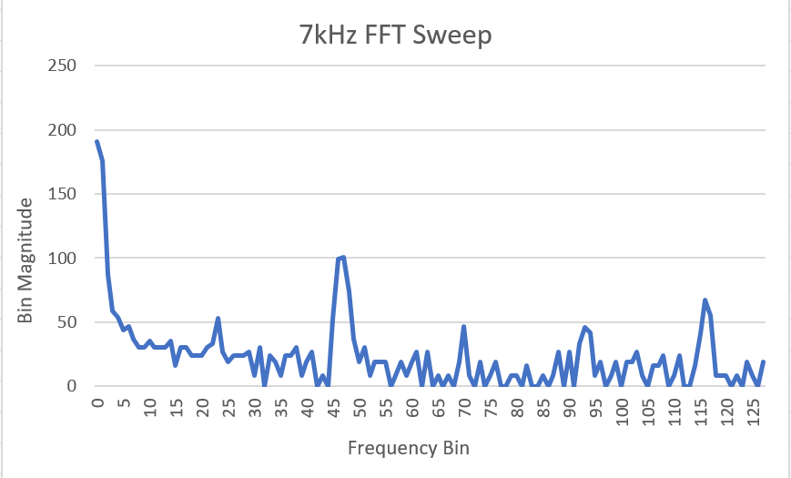
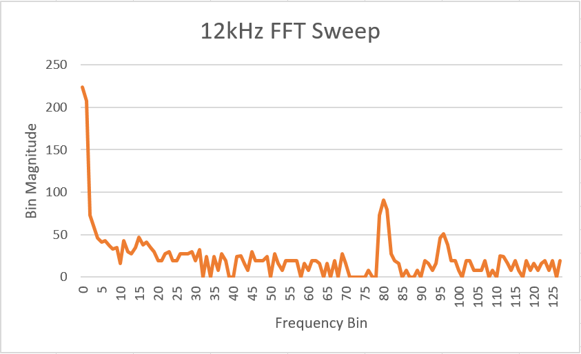
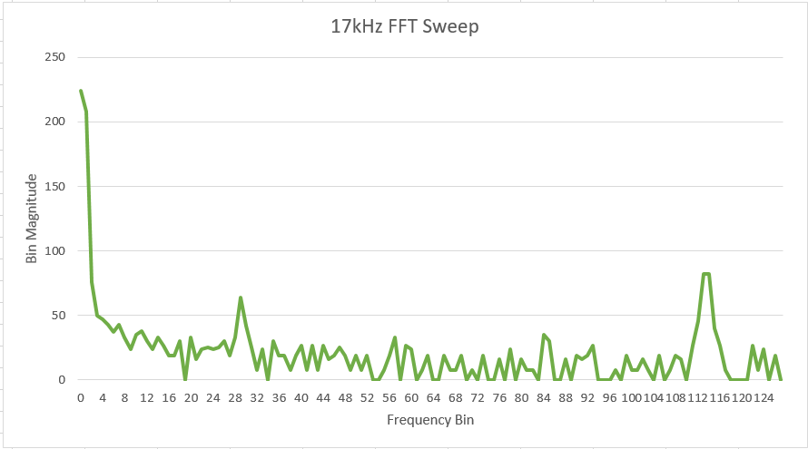

# Milestone 2

### Treasure Detector


In Lab 2, we had already calculated the bins in which each of the treasure frequencies would appear. The 7 kHz treasure would appear in bin 46/47, the 12 kHz treasure would appear in bin 80, and the 17 kHz treasure would appear in bin 113/114. We confirmed our calculations using the following FFT plots.

<div style="text-align:center">  </div>
<div style="text-align:center">  </div>
<div style="text-align:center">  </div>

We had also written code during Lab 2 to distinguish between the 7 kHz and 12 kHz treasures by comparing the value in the bin for each of the treasures with the values in the surrounding bins. We expanded this code to also account for the 17 kHz treasure, using the same algorithm.

```C
// Filtering for high magnitude in bin 47, 80, and 114
    bool top7 = (fft_log_out[47] - fft_log_out[43]) > gain;
    bool bottom7 = (fft_log_out[47] - fft_log_out[50]) > gain;

    bool top12 = (fft_log_out[80] - fft_log_out[77]) > gain;
    bool bottom12 = (fft_log_out[80] - fft_log_out[83]) > gain;

    bool top17 = (fft_log_out[114] - fft_log_out[111]) > gain;
    bool bottom17 = (fft_log_out[114] - fft_log_out[117]) > gain;


///detecting LEDs
    if (top7 && bottom7){ // 7khz
      digitalWrite(led1, HIGH);}   // turn the LED on (HIGH is the voltage level)
    else{
      digitalWrite(led1, LOW);}
    
    if (top12 && bottom12){  // 12khz
      digitalWrite(led2, HIGH);}   // turn the LED on (HIGH is the voltage level)
    else{
      digitalWrite(led2, LOW);}

    if (top17 && bottom17){  // 17khz
      digitalWrite(led3, HIGH);}   // turn the LED on (HIGH is the voltage level)
    else{
      digitalWrite(led3, LOW);}
```

The following video contains a demo of our code using LEDs to easily indicate when each of the treasures is detected.

<div style="text-align: center">
<iframe width="534" height="300" src="https://www.youtube.com/embed/8dsagu16lpo" frameborder="0" allowfullscreen></iframe>
</div>

### Wall Detection
In order to detect walls we used a short range proximity sensor. The sensor uses an IR sensor and an LED to detect large obstacles in front of the sensor. It takes 5V as input, and the output varies between 0.3V and 3.3V. We used the ADC on the Arduino to convert the analog output from the sensor to discrete values and through some trial and error, we decided on a threshold of 450 to detect walls. 

Please, refer to the following video to see how the circuit behaved according to the presence of a wooden wall:

<div style="text-align: center">
<iframe width="534" height="300" src="https://www.youtube.com/embed/eG_E8hI7VyI" frameborder="0" allowfullscreen></iframe>
</div>

This worked reasonably well however we noticed that when the sensor was very close to the wall, and ~30cm away, it would give the same value. Our threshold was higher than that value so that did not affect our robot significantly. We added our sensor to the robot and added it into the code by adding a state called TURN_AROUND, where the robot would turn 180 degrees if it sensed a wall in front of it.

We incorporated our the wall detection code into our code frome milestone one. Below is the snippet where we check whether the sensor is detecting a wall. 
```C
// Wall ahead, turn around 
if(wall_sensor_value > WALL_THRESHOlD)
  next_state = TURN_AROUND;
```
This is the code for the TURN_AROUND state. 
```C
case TURN_AROUND:
  right_servo.write(FULL_POWER_CW);
  left_servo.write(FULL_POWER_CW);
      
  if(previousMillis == 0) {
    previousMillis = millis();
  }
      
  currentMillis = millis();
      
  if(currentMillis - previousMillis > FULL_TURN_LENGTH) next_state = STRAIGHT;
  else next_state = TURN_AROUND;
  break;
```

Please, refer to the following video to see how the robot detected the walls and turned around:

<div style="text-align: center">
<iframe width="534" height="300" src="https://www.youtube.com/embed/C-fAJswnzsU" frameborder="0" allowfullscreen></iframe>
</div>

### Conclusions
For future milestones and labs, we are starting to merge all the software and hardware components inside the robot so we can plan ahead on how to structure the code and even designing a new sophisticated model to assemble all the parts. We are also working on integrating a PID system in order to provide efficiency and precision in movement. 
