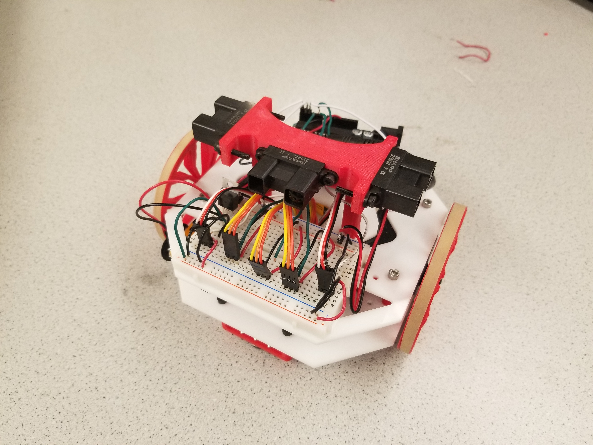

# Milestone 3: Maze Navigation Algorithm
The goal for this milestone is to write a maze navigation algorithm that works in simulation and in real life. After the algorithm finishes exploring the maze, an indicator must show that the robot has explored everything explorable, in both simulation and real life. 


### Simulation

#### Pure DFS
The first implementation  of the simulation implemented pure DFS to explore the maze. The main problem with this approach, is that the position would "jump" to the next branch when the algorithm had reached the end of a branch, instead of backtracking to the correct position. 
#### DFS With Backtracking
We implemented our DFS algorithm iteratively due to constraints related to displaying the maze/using the curses library. Because of that, it was a bit complicated to add backtracking into the algorithm. In order to have the simulated robot backtrack once it reaches a dead end, I used a second stack to keep track of the robot’s history, and a third stack to keep track of each intersection. When the robot reaches a dead end, the most recent intersection is popped off the intersection stack, and then the history from the current point up until the intersection that was just popped is moved onto the main stack. It’s a bit ugly, but it works well for small mazes. For larger mazes the algorithm is extremely inefficient, and traverses a large amount of area twice.

```Python
# coding=UTF-8
from __future__ import print_function
import curses
import time
import locale

locale.setlocale(locale.LC_ALL,"")

maze_str = \
"""11111
10001
11101
10001
10101
10101
11111"""

# Turn maze_str into 2d list
maze = [[True if c == "1" else False for c in row] for row in maze_str.split("\n")]

def maze_simulation(screen, start_x=1, start_y=1):
  # Set up curses stuff 
  screen.clear()
  curses.curs_set(0)
  height, width = screen.getmaxyx()
  curses.init_pair(1, curses.COLOR_WHITE, curses.COLOR_BLACK)
  curses.init_pair(2, curses.COLOR_GREEN, curses.COLOR_BLACK)
  curses.init_pair(3, curses.COLOR_RED, curses.COLOR_BLACK)
  curses.init_pair(4, curses.COLOR_BLUE, curses.COLOR_BLACK)

  # Simple wrapper for drawing a wall
  def drawWall(wall_pos):
    screen.addstr(wall_pos[0], wall_pos[1], u"\u2588".encode("utf-8"), curses.color_pair(1))

  # Draw maze initially
  for y in xrange(len(maze)):
    for x in xrange(len(maze[0])):
      screen.addstr(y, x, "?", curses.color_pair(1))
  screen.refresh()

  # A set of all the visited positions
  visited = set()

  # List of tuples corresponding to positions to move to
  move_stack = [(start_y, start_x)]

  # A stack that contains the movement history_stack of the robot
  history_stack = []

  # A stack that contains the position of intersections
  intersect_stack = []

  # The position of the robot, initalized to the upper left
  pos = (start_y, start_x)

  # A flag used to determine whether to backtrack to prev intersection
  backtrack = False

  while move_stack:
    if backtrack:
      # We need to backtrack, so select appropriate range of history 
      # and then add it onto the move stack
      history_stack.pop()
      tmp = history_stack.pop()
      back = intersect_stack.pop()
      tmp_list = []
      while(tmp != back):
        tmp_list.append(tmp)
        tmp = history_stack.pop()
      history_stack.append(tmp)
      move_stack += list(reversed(tmp_list))
      backtrack = False

    else:
      pos = move_stack.pop()
      history_stack.append(pos)

    # Draw robot position
    screen.addstr(pos[0], pos[1], u"\u2588".encode("utf-8"), curses.color_pair(3))
    if pos not in visited:
      visited.add(pos)
      stack_size = len(move_stack)

      # Check "North"
      if(not maze[pos[0]-1][pos[1]] and (pos[0]-1,pos[1]) not in visited):
        move_stack.append((pos[0]-1, pos[1]))
      elif((pos[0]-1,pos[1]) not in visited):
        drawWall((pos[0]-1, pos[1]));

      # Check "West"
      if(not maze[pos[0]][pos[1]-1] and (pos[0],pos[1]-1) not in visited):
        move_stack.append((pos[0], pos[1]-1))
      elif((pos[0],pos[1]-1) not in visited):
        drawWall((pos[0], pos[1]-1));

      # Check "South"
      if(not maze[pos[0]+1][pos[1]] and (pos[0]+1,pos[1]) not in visited):
        move_stack.append((pos[0]+1, pos[1]))
      elif((pos[0]+1,pos[1]) not in visited):
        drawWall((pos[0]+1, pos[1]));

      # Check "East"
      if(not maze[pos[0]][pos[1]+1] and (pos[0],pos[1]+1) not in visited):
        move_stack.append((pos[0], pos[1]+1))
      elif((pos[0],pos[1]+1) not in visited):
        drawWall((pos[0], pos[1]+1));

      # figure out if we're at intersection or dead-end
      if(len(move_stack) - stack_size == 0):
        backtrack = True
      if(len(move_stack) - stack_size > 1):
        intersect_stack.append(pos)

    # Update the screen, and wait for user to press a key
    screen.refresh()
    c = screen.getch()

    # Change position to path
    screen.addstr(pos[0], pos[1], u"\u2588".encode("utf-8"), curses.color_pair(2))

  # Set color of robot to blue since we're done
  screen.addstr(pos[0], pos[1], u"\u2588".encode("utf-8"), curses.color_pair(4))
  screen.refresh()

  # Maze is explored
  while True:
    continue

curses.wrapper(maze_simulation)
```

Below is a video of our DFS algorithm with backtracking traversing a maze.
Unexplored territories are represented by question marks. Walls are represented by white squares. Explored areas are represented by green squares. The robot, or the current position of the robot is represented by a red square. After the algorithm is finished, the current position of the robot turns blue to indicate that all explorable areas are explored.
<div style="text-align: center">
<iframe width="534" height="300" src="https://www.youtube.com/embed/DidsbgD-tjI" frameborder="0" allowfullscreen></iframe>
</div>


### Real Life
Our robot has 3 wall sensors each installed on the front, left, and right side of the robot. During the navigation, the wall sensors are on average 3-4 inches away from the walls. We 3D printed a mount for 3 long-range IR sensors. The mount was designed to position the sensors for left, front, and right wall detection all 90 degrees apart from each other. THe mount elevated all 3 sensors above the the height of the wheels to avoid obstructing the sensor reading.

Here is a picture of the most recent setup of our robot:
<div style="text-align:center"></div>

Once all sensors, were mounted, we wrote a simple Arduino program to test the sensor’s readings. We took the robot the maze and measured the average distance between the wall and the sensors in multiple orientations. Then we determined the range of sensor values that corresponded to this average distance. As seen below in the detectWalls() function: this range was used in the code to determine whether a wall had been detected or not. 

Here is our code for intersection.
```c
case INTERSECTION:
      if(center_sensor_value > LINE_THRESHOLD) {
        detectWalls();
        if (walls[1] == 0){
          next_state = STRAIGHT; 
        } else{
           if(walls[0] == 1 && walls[2] == 1){
              next_state = TURN_AROUND; 
           }
           else if(walls[0] == 1){
              next_state = RIGHT;
           }
           else if(walls[2] == 1){
              next_state = LEFT;
           }
        }
        previousMillis = 0;
      }
      else next_state = INTERSECTION;
      break;

```

Here is our code for wall detection and priority decision making.
```c
void detectWalls() {
  int lw_raw = analogRead(leftwall_sensor_pin);
  int fw_raw = analogRead(forwardwall_sensor_pin);
  int rw_raw = analogRead(rightwall_sensor_pin);
  if (lw_raw > 400 && lw_raw < 600){
    lw = 1;
  } else{
    lw = 0;
  }
   if (fw_raw > 500 && fw_raw < 600){
    fw = 1;
  } else{
    fw = 0;
  }
   if (rw_raw > 400 && rw_raw <600){
    rw = 1;
  } else{
    rw = 0;
  }
  walls[0] = lw;
  walls[1] = fw;
  walls[2] = rw;
}

```


Please, refer to the following video to see how the robot detected the walls and turned around:

<div style="text-align: center">
<iframe width="560" height="315" src="https://www.youtube.com/embed/orYWxrE-BUk" frameborder="0" gesture="media" allowfullscreen></iframe>
</div>

### Next task and improvements
Due to limited time, we did not have our real life maze navigation run successfully. However, we are certain that our DFS algorithm works in various situations since we had a random maze generator and tested it many times. 

We plan to upgrade our wall detector because they are very unaccurate. The readings from the wall sensor that we are currently using is a bell curve again distance. Also, we belive that the power left in the batteries are also affecting the sensitivity of the sensors and the servos. 
