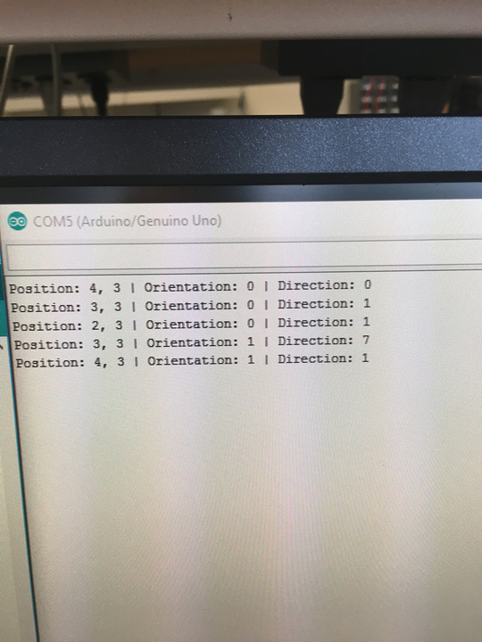
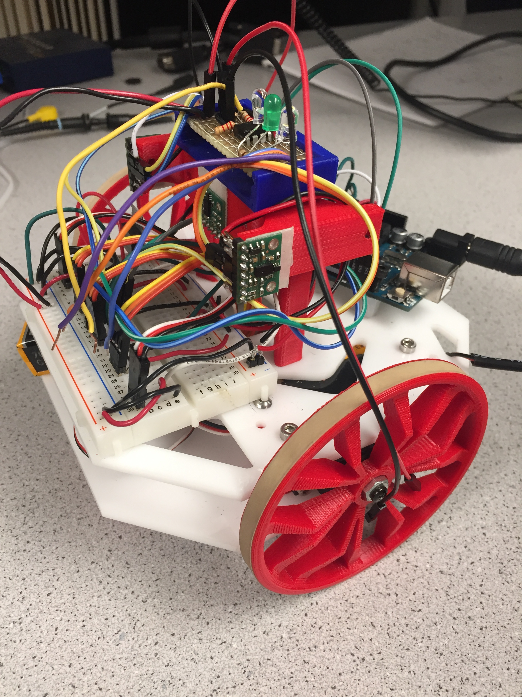

# Milestone 4: Display of Maze Information

### Milestone 3 Update
We have worked on finishing the tasks in Milestone 3 and made some significant progress. Our DFS code is complete but stills needs debugging. We tested extensively and believe that the back-pointer is working.
The picture below shows what we get when we tested the alogrithm on a small 2x2 maze.

### Wall Detection and Treasure Detection
We had upgraded to new wall detection sensor that are much are accurate and reliable. We were also able to read from multiple I2C sensors on the same bus. So that now we do not have to use a MUX or schmist trigger because we have 5 analog inputs left: 3 for line sensors, 1 for IR, and 1 for the microphone. We tuned the range thresholds and updated our code according to the new sensors. 

We copied the circuit from Lab 2 to a soldered board and mounted it on the top of our robot. 
The picture below shows what our robot currently looks like with new wall sensors and the tresure sensors.

### Display
To display the entire maze including walls and treasures, we divided the screen into a 4x5 grid consisting of 96x96 pixel squares. We simplified the 96x96 square to a 12x12 square using the same method as in lab 4. We hard-coded a 12x12 array to contain the colors needed to display the various pieces of information about the maze (outermost elements would be the wall color, center would be an image for treasures). The portions corresponding to the background for treasures was updated based on which treasure was in the given position.

We then had a second array that would store the wall locations and treasure for each square of the maze. We used 1 bit to track whether the location has been visited, 4 bits to track each of the walls, and 2 bits to track the three potential treasures. This array would be updated based on the messages being transmitted from the Arduino. To display this information on the screen, we would check which maze position the current pixel corresponds with as well as which part of the 12x12 grid the pixel belongs in. Depending on the location in the 12x12 square, we would use a different bit of the information stored for the current maze position to determine the color. For instance, a pixel that would be in the first row of the square would use the bit corresponding to the north wall as a select signal for the color. If there was a wall, the color array would be referenced for the appropriate color; otherwise, the color would be white.

In the following display, the walls are represented by the purple stripes. Pink squares represent explored regions and green square represents current position. The red, green, and blue T represents treasures of different frequencies. There are some improvements that need to be made to the display algorithm, as the white portions correspond to an absence of walls and should ideally be pink. A similar issue exists when there is no treasure.

### Done Signal
Since we were not able to successfully communicate between arduino and FPGA, and maze exploration is not done either, we were not able to implement a done signal. 

